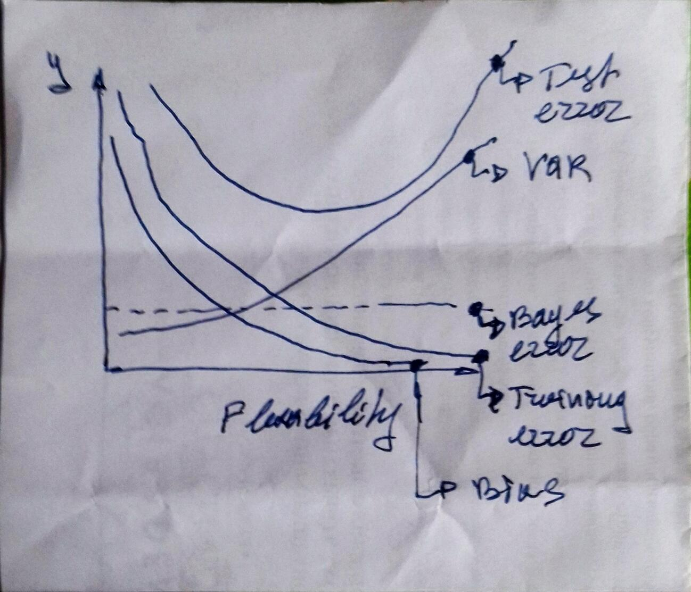

```{r setup, include=FALSE}
knitr::opts_chunk$set(echo = TRUE, warning = FALSE, message = FALSE)
library(MASS)
library(tidyverse)
library(forcats)
library(ISLR)
library(GGally)
library(gridExtra)
```

***

# Conceptual {#conceptual}

***

# *Ex.1* {#ex1} 

For each of parts (a) through (d), indicate whether we would generally
expect the performance of a flexible statistical learning method to be
better or worse than an inflexible method. Justify your answer.

*(a)* The sample size n is extremely large, and the number of predictors
p is small.  

>**Answer:** Flexible is better. Large sample leads to low variance and low bias if flexible method is used.

*(b)* The number of predictors p is extremely large, and the number
of observations n is small.

>**Answer:** Flexible is worse. Small sample leads to high variance.

*(c)* The relationship between the predictors and response is highly
non-linear.

>**Answer:** Flexible is better. Low bias.

*(d)* The variance of the error terms, i.e. σ2 = Var(epsilon), is extremely
high.

>**Answer:** Flexible is worse. A lot of "noise" would be reflected by the model.

# *Ex.2* {#ex2} 

Explain whether each scenario is a classification or regression problem,
and indicate whether we are most interested in inference or prediction.
Finally, provide n and p.

*(a)* We collect a set of data on the top 500 firms in the US. For each
firm we record profit, number of employees, industry and the
CEO salary. We are interested in understanding which factors
affect CEO salary.

>**Answer:** Regression. Inference. `n = 500`, `p = profit + employees + industry`

*(b)* We are considering launching a new product and wish to know
whether it will be a success or a failure. We collect data on 20
similar products that were previously launched. For each product
we have recorded whether it was a success or failure, price
charged for the product, marketing budget, competition price,
and ten other variables.

>**Answer:** Classification. Prediction. `n = 20`, `p = price.charged + budget + comp.price + ....`

*(c)* We are interest in predicting the % change in the USD/Euro
exchange rate in relation to the weekly changes in the world
stock markets. Hence we collect weekly data for all of 2012. For
each week we record the % change in the USD/Euro, the %
change in the US market, the % change in the British market,
and the % change in the German market.

>**Answer:** Regression. Prediction. `n = nbr. of weeks in 2012`, `p = US + GB + DE`

# *Ex.3* {#ex3} 

We now revisit the bias-variance decomposition.

*(a)* Provide a sketch of typical (squared) bias, variance, training error,
test error, and Bayes (or irreducible) error curves, on a single
plot, as we go from less flexible statistical learning methods
towards more flexible approaches. The x-axis should represent the amount of flexibility in the method, and the y-axis should represent the values for each curve. There should be five curves. Make sure to label each one.



*(b)* Explain why each of the five curves has the shape displayed in
part (a).

>**Answer:**  
1. bias - model line approximates better when flex. increases => model error decreases;  
2. variance - increases becauses different training data would give higher deviation for more flexible models;  
3. training error - more drgrees of freedom leads to better approximation;  
4. test error - reflects bias and variance;  
5. bayes error - irreducible error;    

# *Ex.4* {#ex4} 

You will now think of some real-life applications for statistical learning.

*(a)* Describe three real-life applications in which classification might
be useful. Describe the response, as well as the predictors. Is the
goal of each application inference or prediction? Explain your
answer.

>**Answer:**  
1. Energy efficiency classification:   
response -> classes A; B; C; D;  
predictors -> electr. consumption + heat consumption + other consumption;  
goal -> prediction.  
2. User reaction to smart phone notification:  
response -> notification tapped/untapped
predictors -> user activity + call to action type + color set + weather conditions;  
goal -> inference. Tuning for effective notifications.  
3. User action to smart phone app suggested action:  
response -> action taken/not taken;  
predictors -> type of value proposition + color set + type of picture used + suggested action type;  
goal -> inferece. Tuning for action-oriented communication with the user.  

*(b)* Describe three real-life applications in which regression might
be useful. Describe the response, as well as the predictors. Is the
goal of each application inference or prediction? Explain your
answer.

>**Answer:**  
1. Energy consumption:  
response -> kwh;  
predictors -> weather + occupancy + area + type of building;  
goal -> prediction. Predict energy expenses.  
2. Behavior energy savings:  
response -> kwh;  
predictors -> age + number of occupants + type of building + number of teams + avg. salary + type of area;  
goal -> prediction of behavior energy saving measures for buildings.  
3. Energy savings:  
response -> kwh;  
predictors -> type of building + present specific consumption + area + type of energy saving measures;  
goal -> prediction of energy savings

*(c)* Describe three real-life applications in which cluster analysis
might be useful.

>**Answer:**  
1. Classification of Building stock in terms energy saving opportunities;  
2. User types in terms of reaction to notifications;  
3. User types in terms of actions taken.  

# *Ex.5* {#ex5} 

What are the advantages and disadvantages of a very flexible (versus
a less flexible) approach for regression or classification? Under what
circumstances might a more flexible approach be preferred to a less
flexible approach? When might a less flexible approach be preferred?

>**Answer:**  
Adv. -> low training error; low bias/Disadv. -> high variance;  
More flex. is preferred when we have a lot of non-linear training data;  
Less flex. is preferred when we have linear training data; 

# *Ex.6* {#ex6} 

Describe the differences between a parametric and a non-parametric
statistical learning approach. What are the advantages of a parametric
approach to regression or classification (as opposed to a nonparametric
approach)? What are its disadvantages?

>**Answer:**
In param. approach we assume the form of the function / In non-param we do not;   
Adv. of param. approach is that it is simpler to estimate just the coeff. of the chosen form of function;  
Disadv. of param. approach is that the assumption for the form of the function might be wrong.

# *Ex.7* {#ex7} 

The table below provides a training data set containing six observations,
three predictors, and one qualitative response variable.

```{r}

tbl <-
        tibble(
                Obs = 1:6,
                X1 = c(0,2,0,0,-1,1),
                X2 = c(3,0,1,1,0,1),
                X3 = c(0,0,3,2,1,1),
                Y = factor(c("Red", "Red", "Red", "Green", "Green", "Red"))
        )
tbl
```

Suppose we wish to use this data set to make a prediction for Y when
X1 = X2 = X3 = 0 using K-nearest neighbors.

*(a)* Compute the Euclidean distance between each observation and
the test point, X1 = X2 = X3 = 0.

>**Answer:**

```{r}
X0 <- 
        c(0,0,0)        
        
tbl_X <-
        tbl %>%
        select(X1, X2, X3) %>%
        t() %>%
        as.tibble()


Dist <-
        map(tbl_X, function(x) {(x - X0)^2}) %>%
        map_dbl(sum) %>%
        map_dbl(sqrt) 

tbl_D <-
        tbl %>%
        add_column(
                Distance = Dist
        )

tbl_D
```

*(b)* What is our prediction with K = 1? Why?

>**Answer:**  
Green;  
The closest point is Green.

*(c)* What is our prediction with K = 3? Why?

>**Answer:**  
Red;  
We have closest 2 red and 1 green points.

*(d)* If the Bayes decision boundary in this problem is highly nonlinear,
then would we expect the best value for K to be large or
small? Why?

>**Answer:**  
Best value for **K** is small. Then it would be more flexible and go with the nonlinear boundry.

***

# Applied {#applied}

***

# *Ex.8* {#ex8} 

This exercise relates to the College data set, which can be found in
the file College.csv. It contains a number of variables for 777 different
universities and colleges in the US. The variables are...

```{r}

college <- as.tibble(College)
str(college)
summary(college)

college[ , 1:10] %>%
        ggpairs()

college %>%
        ggplot() + 
        geom_boxplot(mapping = aes(x = Private, y = Outstate)) + 
        labs(title = "Outstate versusu Private",
             x = "Private indicator",
             y = "Out-of-state tuition")
        
```
```{r}
# Creating new qualitative variable Ellite

elite <-
        college %>% 
                mutate(Elite = if_else(Top10perc > 50, "Yes", "No")) %>%
                mutate(Elite = as_factor(Elite)) %>%
                select(Elite) 

schools <-
        college %>%
                rownames() %>%
                as_tibble() %>%
                rename(School = value)

bind_cols(schools, elite)

summary(elite)

college %>%
        select(Outstate) %>%
        add_column(Elite = elite$Elite) %>%
        ggplot() +
        geom_boxplot(mapping = aes(x = Elite, y = Outstate)) +
        labs(title = "Outstate versusu Elite",
             x = "Elite indicator",
             y = "Out-of-state tuition")
```

```{r}
# Creating a few histograms of quantitative varables

p1 <-
        ggplot(college) +
        geom_histogram(mapping = aes(x = Apps))

p2 <-
        ggplot(college) +
        geom_histogram(mapping = aes(x = PhD))

p3 <-
        ggplot(college) +
        geom_histogram(mapping = aes(x = Grad.Rate))

p4 <-
        ggplot(college) +
        geom_histogram(mapping = aes(x = Accept))

grid.arrange(p1, p2, p3, p4, nrow = 2)
```

# *Ex.9* {#ex9} 

This exercise involves the Auto data set studied in the lab. Make sure
that the missing values have been removed from the data.

*(a)* Which of the predictors are quantitative, and which are qualitative?

>**Answer:**
Qualitative: `origin`, `name`, `cylinders`  
Quantitative: the others

```{r}
str(Auto)
```

*(b)* What is the range of each quantitative predictor? You can answer
this using the range() function.

>**Answer:**

```{r}
Auto %>%
        select(-name, -origin, -cylinders) %>%
        map(range)
```

*(c)* What is the mean and standard deviation of each quantitative
predictor?

>**Answer:**

```{r}
mean.uf <-
        Auto %>%
                select(-name, -origin, -cylinders) %>%
                map_dbl(mean)

sd.uf <-
        Auto %>%
                select(-name, -origin, -cylinders) %>%
                map_dbl(sd) 

bind_rows(mean.uf, sd.uf) %>% 
        add_column(stat = c("mean", "sd"), .before = 1)
```

*(d)* Now remove the 10th through 85th observations. What is the
range, mean, and standard deviation of each predictor in the
subset of the data that remains?

>**Answer:**

```{r}

Auto %>%
        select(-name, -origin, -cylinders) %>%
        filter(row_number() < 10 | row_number() > 85) %>%
        map(range)
```
     
```{r}

mean.f <-
        Auto %>%
                filter(row_number() < 10 | row_number() > 85) %>%
                select(-name, -origin, -cylinders) %>%
                map_dbl(mean)

sd.f <-Auto %>%
                filter(row_number() < 10 | row_number() > 85) %>%    
                select(-name, -origin, -cylinders) %>%
                map_dbl(sd) 
        

bind_rows(mean.f, sd.f) %>% 
        add_column(stat = c("mean", "sd"), .before = 1)
```
*(e)* Using the full data set, investigate the predictors graphically,
using scatterplots or other tools of your choice. Create some plots
highlighting the relationships among the predictors. Comment
on your findings.

>**Answer:**

```{r}

Auto.Pred <-
        Auto %>%
        select(-name) %>%
        mutate(
                cylinders = as_factor(as.character(cylinders)),
                origin = as_factor(as.character(origin))
        )

Auto.Pred$cylinders <-
        Auto.Pred$cylinders %>%
        factor(levels = c("3", "4", "5", "6", "8"))

Auto.Pred$origin <-
        Auto.Pred$origin %>%
        factor(levels = c("1", "2", "3"))

Auto.Pred %>%
        ggpairs()
```

> `mpg` is strongly ngatively correlated to `displacement` `horsepower`, `weight`
Japanese cars consume least mpg.

*(f)* Suppose that we wish to predict gas mileage (mpg) on the basis
of the other variables. Do your plots suggest that any of the
other variables might be useful in predicting mpg? Justify your
answer.

>**Answer:**
see *(f)*

# *Ex.10* {#ex10} 

This exercise involves the Boston housing data set.

*(a)*
```{r}
str(Boston)
```

*(b)* Make some pairwise scatterplots of the predictors (columns) in
this data set. Describe your findings.

>**Answer:**
`crim` v/s the others

```{r}
Boston %>%
        gather(-crim, key = "var", value = "value") %>%
        ggplot(aes(y = crim, x = value)) + 
        geom_point() + 
        facet_wrap(~var, scales = "free")
```
  
*(c)* Are any of the predictors associated with per capita crime rate?
If so, explain the relationship.

>**Answer:**
positive relationship pattern with `age`, `lstat`;
negative reltionship pattern with `dis`, `medv`

*(d)* Do any of the suburbs of Boston appear to have particularly
high crime rates? Tax rates? Pupil-teacher ratios? Comment on
the range of each predictor.

>**Answer:**

```{r}
Boston %>%
        ggplot(aes(crim)) +
        geom_histogram(binwidth = 2)
```
  
> no peak in `crim`

```{r}
Boston %>%
        ggplot(aes(tax)) +
        geom_histogram(binwidth = 5)

highTax <-
        Boston %>%
        select(tax) %>%
        filter(tax > 600) %>%
        summarize(
                "High Tax" = n()
        )
```
  
> with high `tax` values are `r highTax` 

```{r}
Boston %>%
        ggplot(aes(ptratio)) +
        geom_histogram()
```
  
> there is an abnormal peak value at around 20

*(e)* How many of the suburbs in this data set bound the Charles
river?

>**Answer:**

```{r}
Boston %>%
        select(chas) %>%
        filter(chas == 1) %>%
        summarise(
                count = n()
        )
```

*(f)* What is the median pupil-teacher ratio among the towns in this data set ?

>**Answer:**

```{r}
median(Boston$ptratio)
```

*(g)* Which suburb of Boston has lowest median value of owneroccupied
homes? What are the values of the other predictors
for that suburb, and how do those values compare to the overall
ranges for those predictors? Comment on your findings.

>**Answer:**

```{r}
crim_v <-
        Boston %>%
        filter(medv == min(medv))%>%
        select(crim)

crim_a <-
        Boston %>%
        select(crim)

perctile <- ecdf(crim_a$crim)

crim_v %>%
        mutate(perc = perctile(crim))
```
  
> Observed percentiles for `crime` values at the filtered `mdev`. 

*(h)* In this data set, how many of the suburbs average more than
seven rooms per dwelling? More than eight rooms per dwelling?
Comment on the suburbs that average more than eight rooms
per dwelling.

>**Answer:**

```{r}
count_more_than_7 <-
        Boston %>%
        filter(rm > 7) %>%
        summarize(
                n()
        )

count_more_than_8 <-
        Boston %>%
        filter(rm > 8) %>%
        summarize(
                n()
        )

more_than_8 <-
        Boston %>%
        filter(rm>8) %>%
        select(-rm) %>%
        map_dbl(mean)

more_than_7 <-
        Boston %>%
        filter(rm>7 & rm<8) %>%
        select(-rm) %>%
        map_dbl(mean) 
all <-
        Boston %>%
        select(-rm) %>%
        map_dbl(mean)

bind_rows(all, more_than_7, more_than_8) %>%
        add_column(nbr = c("all", ">7", ">8"), .before = 1) %>%
        select(-ptratio, -black)
```

> `zn` change is most significant