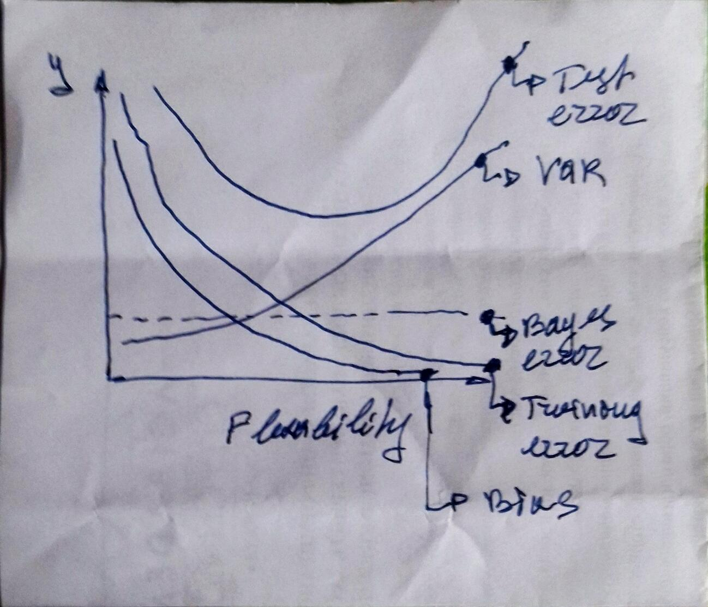

## Conceptual
*Ex.1* For each of parts (a) through (d), indicate whether we would generally
expect the performance of a flexible statistical learning method to be
better or worse than an inflexible method. Justify your answer.

*(a)* The sample size n is extremely large, and the number of predictors
p is small.  

>**Answer:** Flexible is better. Large sample leads to low variance and low bias if flexible method is used.

*(b)* The number of predictors p is extremely large, and the number
of observations n is small.

>**Answer:** Flexible is worse. Small sample leads to high variance.

*(c)* The relationship between the predictors and response is highly
non-linear.

>**Answer:** Flexible is better. Low bias.

*(d)* The variance of the error terms, i.e. σ2 = Var(epsilon), is extremely
high.

>**Answer:** Flexible is worse. A lot of "noise" would be reflected by the model.

*Ex.2* Explain whether each scenario is a classification or regression problem,
and indicate whether we are most interested in inference or prediction.
Finally, provide n and p.

*(a)* We collect a set of data on the top 500 firms in the US. For each
firm we record profit, number of employees, industry and the
CEO salary. We are interested in understanding which factors
affect CEO salary.

>**Answer:** Regression. Inference. `n = 500`, `p = profit + employees + industry`

*(b)* We are considering launching a new product and wish to know
whether it will be a success or a failure. We collect data on 20
similar products that were previously launched. For each product
we have recorded whether it was a success or failure, price
charged for the product, marketing budget, competition price,
and ten other variables.

>**Answer:** Classification. Prediction. `n = 20`, `p = price.charged + budget + comp.price + ....`

*(c)* We are interest in predicting the % change in the USD/Euro
exchange rate in relation to the weekly changes in the world
stock markets. Hence we collect weekly data for all of 2012. For
each week we record the % change in the USD/Euro, the %
change in the US market, the % change in the British market,
and the % change in the German market.

>**Answer:** Regression. Prediction. `n = nbr. of weeks in 2012`, `p = US + GB + DE`

*Ex.3* We now revisit the bias-variance decomposition.

*(a)* Provide a sketch of typical (squared) bias, variance, training error,
test error, and Bayes (or irreducible) error curves, on a single
plot, as we go from less flexible statistical learning methods
towards more flexible approaches. The x-axis should represent the amount of flexibility in the method, and the y-axis should represent the values for each curve. There should be five curves. Make sure to label each one.



*(b)* Explain why each of the five curves has the shape displayed in
part (a).

>**Answer:**  
1. bias - model line approximates better when flex. increases => model error decreases;  
2. variance - increases becauses different training data would give higher deviation for more flexible models;  
3. training error - more drgrees of freedom leads to better approximation;  
4. test error - reflects bias and variance;  
5. bayes error - irreducible error;    

*Ex.4* You will now think of some real-life applications for statistical learning.

*(a)* Describe three real-life applications in which classification might
be useful. Describe the response, as well as the predictors. Is the
goal of each application inference or prediction? Explain your
answer.

>**Answer:**  
1. Energy efficiency classification:   
response -> classes A; B; C; D;  
predictors -> electr. consumption + heat consumption + other consumption;  
goal -> prediction.  
2. User reaction to smart phone notification:  
response -> notification tapped/untapped
predictors -> user activity + call to action type + color set + weather conditions;  
goal -> inference. Tuning for effective notifications.  
3. User action to smart phone app suggested action:  
response -> action taken/not taken;  
predictors -> type of value proposition + color set + type of picture used + suggested action type;  
goal -> inferece. Tuning for action-oriented communication with the user.  

*(b)* Describe three real-life applications in which regression might
be useful. Describe the response, as well as the predictors. Is the
goal of each application inference or prediction? Explain your
answer.

>**Answer:**  
1. Energy consumption:  
response -> kwh;  
predictors -> weather + occupancy + area + type of building;  
goal -> prediction. Predict energy expenses.  
2. Behavior energy savings:  
response -> kwh;  
predictors -> age + number of occupants + type of building + number of teams + avg. salary + type of area;  
goal -> prediction of behavior energy saving measures for buildings.  
3. Energy savings:  
response -> kwh;  
predictors -> type of building + present specific consumption + area + type of energy saving measures;  
goal -> prediction of energy savings

*(c)* Describe three real-life applications in which cluster analysis
might be useful.

>**Answer:**  
1. Classification of Building stock in terms energy saving opportunities;  
2. User types in terms of reaction to notifications;  
3. User types in terms of actions taken.  

*Ex.5* What are the advantages and disadvantages of a very flexible (versus
a less flexible) approach for regression or classification? Under what
circumstances might a more flexible approach be preferred to a less
flexible approach? When might a less flexible approach be preferred?

>**Answer:**  
Adv. -> low training error; low bias/Disadv. -> high variance;  
More flex. is preferred when we have a lot of non-linear training data;  
Less flex. is preferred when we have linear training data; 

*Ex.6* Describe the differences between a parametric and a non-parametric
statistical learning approach. What are the advantages of a parametric
approach to regression or classification (as opposed to a nonparametric
approach)? What are its disadvantages?

>**Answer:**
In param. approach we assume the form of the function / In non-param we do not;   
Adv. of param. approach is that it is simpler to estimate just the coeff. of the chosen form of function;  
Disadv. of param. approach is that the assumption for the form of the function might be wrong.

*Ex.7* The table below provides a training data set containing six observations,
three predictors, and one qualitative response variable.


```r
tbl <-
        tibble(
                Obs = 1:6,
                X1 = c(0,2,0,0,-1,1),
                X2 = c(3,0,1,1,0,1),
                X3 = c(0,0,3,2,1,1),
                Y = factor(c("Red", "Red", "Red", "Green", "Green", "Red"))
        )
tbl
```

```
## # A tibble: 6 x 5
##     Obs    X1    X2    X3 Y    
##   <int> <dbl> <dbl> <dbl> <fct>
## 1     1     0     3     0 Red  
## 2     2     2     0     0 Red  
## 3     3     0     1     3 Red  
## 4     4     0     1     2 Green
## 5     5    -1     0     1 Green
## 6     6     1     1     1 Red
```

Suppose we wish to use this data set to make a prediction for Y when
X1 = X2 = X3 = 0 using K-nearest neighbors.

*(a)* Compute the Euclidean distance between each observation and
the test point, X1 = X2 = X3 = 0.

>**Answer:**


```r
X0 <- 
        c(0,0,0)        
        
tbl_X <-
        tbl %>%
        select(X1, X2, X3) %>%
        t() %>%
        as.tibble()


Dist <-
        map(tbl_X, function(x) {(x - X0)^2}) %>%
        map_dbl(sum) %>%
        map_dbl(sqrt) 

tbl_D <-
        tbl %>%
        add_column(
                Distance = Dist
        )

tbl_D
```

```
## # A tibble: 6 x 6
##     Obs    X1    X2    X3 Y     Distance
##   <int> <dbl> <dbl> <dbl> <fct>    <dbl>
## 1     1     0     3     0 Red       3   
## 2     2     2     0     0 Red       2   
## 3     3     0     1     3 Red       3.16
## 4     4     0     1     2 Green     2.24
## 5     5    -1     0     1 Green     1.41
## 6     6     1     1     1 Red       1.73
```

*(b)* What is our prediction with K = 1? Why?

>**Answer:**  
Green;  
The closest point is Green.

*(c)* What is our prediction with K = 3? Why?

>**Answer:**  
Red;  
We have closest 2 red and 1 green points.

*(d)* If the Bayes decision boundary in this problem is highly nonlinear,
then would we expect the best value for K to be large or
small? Why?

>**Answer:**  
Best value for **K** is small. Then it would be more flexible and go with the nonlinear boundry.

## Applied

*Ex.8* This exercise relates to the College data set, which can be found in
the file College.csv. It contains a number of variables for 777 different
universities and colleges in the US. The variables are...


```r
college <- as.tibble(College)
str(college)
```

```
## Classes 'tbl_df', 'tbl' and 'data.frame':	777 obs. of  18 variables:
##  $ Private    : Factor w/ 2 levels "No","Yes": 2 2 2 2 2 2 2 2 2 2 ...
##  $ Apps       : num  1660 2186 1428 417 193 ...
##  $ Accept     : num  1232 1924 1097 349 146 ...
##  $ Enroll     : num  721 512 336 137 55 158 103 489 227 172 ...
##  $ Top10perc  : num  23 16 22 60 16 38 17 37 30 21 ...
##  $ Top25perc  : num  52 29 50 89 44 62 45 68 63 44 ...
##  $ F.Undergrad: num  2885 2683 1036 510 249 ...
##  $ P.Undergrad: num  537 1227 99 63 869 ...
##  $ Outstate   : num  7440 12280 11250 12960 7560 ...
##  $ Room.Board : num  3300 6450 3750 5450 4120 ...
##  $ Books      : num  450 750 400 450 800 500 500 450 300 660 ...
##  $ Personal   : num  2200 1500 1165 875 1500 ...
##  $ PhD        : num  70 29 53 92 76 67 90 89 79 40 ...
##  $ Terminal   : num  78 30 66 97 72 73 93 100 84 41 ...
##  $ S.F.Ratio  : num  18.1 12.2 12.9 7.7 11.9 9.4 11.5 13.7 11.3 11.5 ...
##  $ perc.alumni: num  12 16 30 37 2 11 26 37 23 15 ...
##  $ Expend     : num  7041 10527 8735 19016 10922 ...
##  $ Grad.Rate  : num  60 56 54 59 15 55 63 73 80 52 ...
```

```r
summary(college)
```

```
##  Private        Apps           Accept          Enroll       Top10perc    
##  No :212   Min.   :   81   Min.   :   72   Min.   :  35   Min.   : 1.00  
##  Yes:565   1st Qu.:  776   1st Qu.:  604   1st Qu.: 242   1st Qu.:15.00  
##            Median : 1558   Median : 1110   Median : 434   Median :23.00  
##            Mean   : 3002   Mean   : 2019   Mean   : 780   Mean   :27.56  
##            3rd Qu.: 3624   3rd Qu.: 2424   3rd Qu.: 902   3rd Qu.:35.00  
##            Max.   :48094   Max.   :26330   Max.   :6392   Max.   :96.00  
##    Top25perc      F.Undergrad     P.Undergrad         Outstate    
##  Min.   :  9.0   Min.   :  139   Min.   :    1.0   Min.   : 2340  
##  1st Qu.: 41.0   1st Qu.:  992   1st Qu.:   95.0   1st Qu.: 7320  
##  Median : 54.0   Median : 1707   Median :  353.0   Median : 9990  
##  Mean   : 55.8   Mean   : 3700   Mean   :  855.3   Mean   :10441  
##  3rd Qu.: 69.0   3rd Qu.: 4005   3rd Qu.:  967.0   3rd Qu.:12925  
##  Max.   :100.0   Max.   :31643   Max.   :21836.0   Max.   :21700  
##    Room.Board       Books           Personal         PhD        
##  Min.   :1780   Min.   :  96.0   Min.   : 250   Min.   :  8.00  
##  1st Qu.:3597   1st Qu.: 470.0   1st Qu.: 850   1st Qu.: 62.00  
##  Median :4200   Median : 500.0   Median :1200   Median : 75.00  
##  Mean   :4358   Mean   : 549.4   Mean   :1341   Mean   : 72.66  
##  3rd Qu.:5050   3rd Qu.: 600.0   3rd Qu.:1700   3rd Qu.: 85.00  
##  Max.   :8124   Max.   :2340.0   Max.   :6800   Max.   :103.00  
##     Terminal       S.F.Ratio      perc.alumni        Expend     
##  Min.   : 24.0   Min.   : 2.50   Min.   : 0.00   Min.   : 3186  
##  1st Qu.: 71.0   1st Qu.:11.50   1st Qu.:13.00   1st Qu.: 6751  
##  Median : 82.0   Median :13.60   Median :21.00   Median : 8377  
##  Mean   : 79.7   Mean   :14.09   Mean   :22.74   Mean   : 9660  
##  3rd Qu.: 92.0   3rd Qu.:16.50   3rd Qu.:31.00   3rd Qu.:10830  
##  Max.   :100.0   Max.   :39.80   Max.   :64.00   Max.   :56233  
##    Grad.Rate     
##  Min.   : 10.00  
##  1st Qu.: 53.00  
##  Median : 65.00  
##  Mean   : 65.46  
##  3rd Qu.: 78.00  
##  Max.   :118.00
```

```r
college[ , 1:10] %>%
        ggpairs()
```

<!-- -->

```r
college %>%
        ggplot() + 
        geom_boxplot(mapping = aes(x = Private, y = Outstate)) + 
        labs(title = "Outstate versusu Private",
             x = "Private indicator",
             y = "Out-of-state tuition")
```

<!-- -->

```r
# Creating new qualitative variable Ellite

elite <-
        college %>% 
                mutate(Elite = if_else(Top10perc > 50, "Yes", "No")) %>%
                mutate(Elite = as_factor(Elite)) %>%
                select(Elite) 

schools <-
        college %>%
                rownames() %>%
                as_tibble() %>%
                rename(School = value)

bind_cols(schools, elite)
```

```
## # A tibble: 777 x 2
##    School                       Elite
##    <chr>                        <fct>
##  1 Abilene Christian University No   
##  2 Adelphi University           No   
##  3 Adrian College               No   
##  4 Agnes Scott College          Yes  
##  5 Alaska Pacific University    No   
##  6 Albertson College            No   
##  7 Albertus Magnus College      No   
##  8 Albion College               No   
##  9 Albright College             No   
## 10 Alderson-Broaddus College    No   
## # ... with 767 more rows
```

```r
summary(elite)
```

```
##  Elite    
##  No :699  
##  Yes: 78
```

```r
college %>%
        select(Outstate) %>%
        add_column(Elite = elite$Elite) %>%
        ggplot() +
        geom_boxplot(mapping = aes(x = Elite, y = Outstate)) +
        labs(title = "Outstate versusu Elite",
             x = "Elite indicator",
             y = "Out-of-state tuition")
```

<!-- -->


```r
# Creating a few histograms of quantitative varables

p1 <-
        ggplot(college) +
        geom_histogram(mapping = aes(x = Apps))

p2 <-
        ggplot(college) +
        geom_histogram(mapping = aes(x = PhD))

p3 <-
        ggplot(college) +
        geom_histogram(mapping = aes(x = Grad.Rate))

p4 <-
        ggplot(college) +
        geom_histogram(mapping = aes(x = Accept))

grid.arrange(p1, p2, p3, p4, nrow = 2)
```

<!-- -->

*Ex.9* This exercise involves the Auto data set studied in the lab. Make sure
that the missing values have been removed from the data.

*(a)* Which of the predictors are quantitative, and which are qualitative?

>**Answer:**
Qualitative: `origin`, `name`, `cylinders`  
Quantitative: the others


```r
str(Auto)
```

```
## 'data.frame':	392 obs. of  9 variables:
##  $ mpg         : num  18 15 18 16 17 15 14 14 14 15 ...
##  $ cylinders   : num  8 8 8 8 8 8 8 8 8 8 ...
##  $ displacement: num  307 350 318 304 302 429 454 440 455 390 ...
##  $ horsepower  : num  130 165 150 150 140 198 220 215 225 190 ...
##  $ weight      : num  3504 3693 3436 3433 3449 ...
##  $ acceleration: num  12 11.5 11 12 10.5 10 9 8.5 10 8.5 ...
##  $ year        : num  70 70 70 70 70 70 70 70 70 70 ...
##  $ origin      : num  1 1 1 1 1 1 1 1 1 1 ...
##  $ name        : Factor w/ 304 levels "amc ambassador brougham",..: 49 36 231 14 161 141 54 223 241 2 ...
```

*(b)* What is the range of each quantitative predictor? You can answer
this using the range() function.

>**Answer:**


```r
Auto %>%
        select(-name, -origin, -cylinders) %>%
        map(range)
```

```
## $mpg
## [1]  9.0 46.6
## 
## $displacement
## [1]  68 455
## 
## $horsepower
## [1]  46 230
## 
## $weight
## [1] 1613 5140
## 
## $acceleration
## [1]  8.0 24.8
## 
## $year
## [1] 70 82
```

*(c)* What is the mean and standard deviation of each quantitative
predictor?

>**Answer:**


```r
mean.uf <-
        Auto %>%
                select(-name, -origin, -cylinders) %>%
                map_dbl(mean)

sd.uf <-
        Auto %>%
                select(-name, -origin, -cylinders) %>%
                map_dbl(sd) 

bind_rows(mean.uf, sd.uf) %>% 
        add_column(stat = c("mean", "sd"), .before = 1)
```

```
## # A tibble: 2 x 7
##   stat    mpg displacement horsepower weight acceleration  year
##   <chr> <dbl>        <dbl>      <dbl>  <dbl>        <dbl> <dbl>
## 1 mean  23.4          194.      104.   2978.        15.5  76.0 
## 2 sd     7.81         105.       38.5   849.         2.76  3.68
```

*(d)* Now remove the 10th through 85th observations. What is the
range, mean, and standard deviation of each predictor in the
subset of the data that remains?

>**Answer:**


```r
Auto %>%
        select(-name, -origin, -cylinders) %>%
        filter(row_number() < 10 | row_number() > 85) %>%
        map(range)
```

```
## $mpg
## [1] 11.0 46.6
## 
## $displacement
## [1]  68 455
## 
## $horsepower
## [1]  46 230
## 
## $weight
## [1] 1649 4997
## 
## $acceleration
## [1]  8.5 24.8
## 
## $year
## [1] 70 82
```
     

```r
mean.f <-
        Auto %>%
                filter(row_number() < 10 | row_number() > 85) %>%
                select(-name, -origin, -cylinders) %>%
                map_dbl(mean)

sd.f <-Auto %>%
                filter(row_number() < 10 | row_number() > 85) %>%    
                select(-name, -origin, -cylinders) %>%
                map_dbl(sd) 
        

bind_rows(mean.f, sd.f) %>% 
        add_column(stat = c("mean", "sd"), .before = 1)
```

```
## # A tibble: 2 x 7
##   stat    mpg displacement horsepower weight acceleration  year
##   <chr> <dbl>        <dbl>      <dbl>  <dbl>        <dbl> <dbl>
## 1 mean  24.4         187.       101.   2936.        15.7  77.1 
## 2 sd     7.87         99.7       35.7   811.         2.69  3.11
```
*(e)* Using the full data set, investigate the predictors graphically,
using scatterplots or other tools of your choice. Create some plots
highlighting the relationships among the predictors. Comment
on your findings.

>**Answer:**


```r
Auto.Pred <-
        Auto %>%
        select(-name) %>%
        mutate(
                cylinders = as_factor(as.character(cylinders)),
                origin = as_factor(as.character(origin))
        )

Auto.Pred$cylinders <-
        Auto.Pred$cylinders %>%
        factor(levels = c("3", "4", "5", "6", "8"))

Auto.Pred$origin <-
        Auto.Pred$origin %>%
        factor(levels = c("1", "2", "3"))

Auto.Pred %>%
        ggpairs()
```

<!-- -->

> `mpg` is strongly ngatively correlated to `displacement` `horsepower`, `weight`
Japanese cars consume least mpg.

*(f)* Suppose that we wish to predict gas mileage (mpg) on the basis
of the other variables. Do your plots suggest that any of the
other variables might be useful in predicting mpg? Justify your
answer.

>**Answer:**
see *(f)*

*Ex.10* This exercise involves the Boston housing data set.

*(a)*

```r
str(Boston)
```

```
## 'data.frame':	506 obs. of  14 variables:
##  $ crim   : num  0.00632 0.02731 0.02729 0.03237 0.06905 ...
##  $ zn     : num  18 0 0 0 0 0 12.5 12.5 12.5 12.5 ...
##  $ indus  : num  2.31 7.07 7.07 2.18 2.18 2.18 7.87 7.87 7.87 7.87 ...
##  $ chas   : int  0 0 0 0 0 0 0 0 0 0 ...
##  $ nox    : num  0.538 0.469 0.469 0.458 0.458 0.458 0.524 0.524 0.524 0.524 ...
##  $ rm     : num  6.58 6.42 7.18 7 7.15 ...
##  $ age    : num  65.2 78.9 61.1 45.8 54.2 58.7 66.6 96.1 100 85.9 ...
##  $ dis    : num  4.09 4.97 4.97 6.06 6.06 ...
##  $ rad    : int  1 2 2 3 3 3 5 5 5 5 ...
##  $ tax    : num  296 242 242 222 222 222 311 311 311 311 ...
##  $ ptratio: num  15.3 17.8 17.8 18.7 18.7 18.7 15.2 15.2 15.2 15.2 ...
##  $ black  : num  397 397 393 395 397 ...
##  $ lstat  : num  4.98 9.14 4.03 2.94 5.33 ...
##  $ medv   : num  24 21.6 34.7 33.4 36.2 28.7 22.9 27.1 16.5 18.9 ...
```

*(b)* Make some pairwise scatterplots of the predictors (columns) in
this data set. Describe your findings.

>**Answer:**
`crim` v/s the others


```r
Boston %>%
        gather(-crim, key = "var", value = "value") %>%
        ggplot(aes(y = crim, x = value)) + 
        geom_point() + 
        facet_wrap(~var, scales = "free")
```

<!-- -->
  
*(c)* Are any of the predictors associated with per capita crime rate?
If so, explain the relationship.

>**Answer:**
positive relationship pattern with `age`, `lstat`;
negative reltionship pattern with `dis`, `medv`

*(d)* Do any of the suburbs of Boston appear to have particularly
high crime rates? Tax rates? Pupil-teacher ratios? Comment on
the range of each predictor.

>**Answer:**


```r
Boston %>%
        ggplot(aes(crim)) +
        geom_histogram(binwidth = 2)
```

<!-- -->
  
> no peak in `crim`


```r
Boston %>%
        ggplot(aes(tax)) +
        geom_histogram(binwidth = 5)
```

<!-- -->

```r
highTax <-
        Boston %>%
        select(tax) %>%
        filter(tax > 600) %>%
        summarize(
                "High Tax" = n()
        )
```
  
> with high `tax` values are 137 


```r
Boston %>%
        ggplot(aes(ptratio)) +
        geom_histogram()
```

<!-- -->
  
> there is an abnormal peak value at around 20

*(e)* How many of the suburbs in this data set bound the Charles
river?

>**Answer:**


```r
Boston %>%
        select(chas) %>%
        filter(chas == 1) %>%
        summarise(
                count = n()
        )
```

```
##   count
## 1    35
```

*(f)* What is the median pupil-teacher ratio among the towns in this data set ?

>**Answer:**


```r
median(Boston$ptratio)
```

```
## [1] 19.05
```

*(g)* Which suburb of Boston has lowest median value of owneroccupied
homes? What are the values of the other predictors
for that suburb, and how do those values compare to the overall
ranges for those predictors? Comment on your findings.

>**Answer:**


```r
crim_v <-
        Boston %>%
        filter(medv == min(medv))%>%
        select(crim)

crim_a <-
        Boston %>%
        select(crim)

perctile <- ecdf(crim_a$crim)

crim_v %>%
        mutate(perc = perctile(crim))
```

```
##      crim      perc
## 1 38.3518 0.9881423
## 2 67.9208 0.9960474
```
  
> Observed percentiles for `crime` values at the filtered `mdev`. 

*(h)* In this data set, how many of the suburbs average more than
seven rooms per dwelling? More than eight rooms per dwelling?
Comment on the suburbs that average more than eight rooms
per dwelling.

>**Answer:**


```r
count_more_than_7 <-
        Boston %>%
        filter(rm > 7) %>%
        summarize(
                n()
        )

count_more_than_8 <-
        Boston %>%
        filter(rm > 8) %>%
        summarize(
                n()
        )

more_than_8 <-
        Boston %>%
        filter(rm>8) %>%
        select(-rm) %>%
        map_dbl(mean)

more_than_7 <-
        Boston %>%
        filter(rm>7 & rm<8) %>%
        select(-rm) %>%
        map_dbl(mean) 
all <-
        Boston %>%
        select(-rm) %>%
        map_dbl(mean)

bind_rows(all, more_than_7, more_than_8) %>%
        add_column(nbr = c("all", ">7", ">8"), .before = 1) %>%
        select(-ptratio, -black)
```

```
## # A tibble: 3 x 12
##   nbr    crim    zn indus   chas   nox   age   dis   rad   tax lstat  medv
##   <chr> <dbl> <dbl> <dbl>  <dbl> <dbl> <dbl> <dbl> <dbl> <dbl> <dbl> <dbl>
## 1 all   3.61   11.4 11.1  0.0692 0.555  68.6  3.80  9.55  408. 12.7   22.5
## 2 >7    1.05   31.9  5.44 0.118  0.496  57.9  4.40  5.61  309.  5.77  36.9
## 3 >8    0.719  13.6  7.08 0.154  0.539  71.5  3.43  7.46  325.  4.31  44.2
```

> `zn` change is most significant
