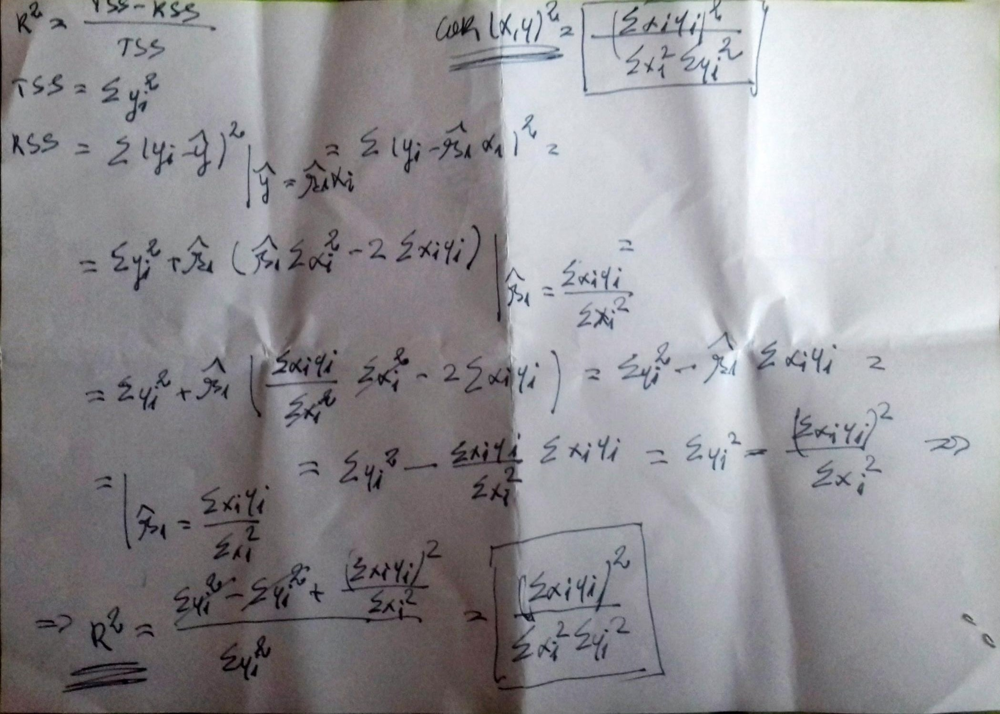

## Conceptual

*Ex.1* Describe the null hypotheses to which the p-values given in Table 3.4
correspond. Explain what conclusions you can draw based on these
p-values. Your explanation should be phrased in terms of sales, TV,
radio, and newspaper, rather than in terms of the coefficients of the
linear model.

>**Answer:** We observe small p-values < 0.05 for `TV` and `radio`, which means that we reject the null hypoteses, stating that there is no association with sales:   
$H_0 : \beta_1 = 0$  
$H_0 : \beta_2 = 0$  
The null hypoteses can not be rejected for the `newspaper`   

*Ex.2* Carefully explain the differences between the KNN classifier and KNN
regression methods.

>**Answer:** KNN classifier clissifies an output to one group or another, where the KNN regression predicts an ouput value based on input. Both methods are "trained" on distances to nearest observations.

*Ex.3* Suppose we have a data set with five predictors, X1 =GPA, X2 = IQ,
X3 = Gender (1 for Female and 0 for Male), X4 = Interaction between
GPA and IQ, and X5 = Interaction between GPA and Gender. The
response is starting salary after graduation (in thousands of dollars).
Suppose we use least squares to fit the model, and get $\hat\beta$ 0 = 50, $\hat\beta$ 1 =
20, $\hat\beta$ 2 = 0.07, $\hat\beta$ 3 = 35, $\hat\beta$ 4 = 0.01, $\hat\beta$ 5 = −10.

*(a)* Which answer is correct, and why?

i. For a fixed value of IQ and GPA, males earn more on average
than females.
ii. For a fixed value of IQ and GPA, females earn more on
average than males.
iii. For a fixed value of IQ and GPA, males earn more on average
than females provided that the GPA is high enough.
iv. For a fixed value of IQ and GPA, females earn more on
average than males provided that the GPA is high enough.

>**Answer:** point(iii.), provided that GPA is greater than 3.5


```r
# Male > Female when
# 50 + 20*GPA > 85 + 10*GPA
```

*(b)* Predict the salary of a female with IQ of 110 and a GPA of 4.0.

>**Answer:** 137.1


```r
IQ <- 110
GPA <- 4.0
50 + 20*GPA + 0.07*IQ + 35 + 0.01*GPA*IQ - 10*GPA 
```

```
## [1] 137.1
```

*(c)* True or false: Since the coefficient for the GPA/IQ interaction
term is very small, there is very little evidence of an interaction
effect. Justify your answer.

>**Answer:** False. p-value should be examined for statistical significance of the effect.

*Ex.4* I collect a set of data (n = 100 observations) containing a single
predictor and a quantitative response. I then fit a linear regression
model to the data, as well as a separate cubic regression, i.e. Y =
$\beta_0$ + $\beta_1X$ + $\beta_2X^2$ + $\beta_3X^3$ + $\epsilon$.

*(a)* Suppose that the true relationship between X and Y is linear,
i.e. $Y = \beta_0 + \beta_1X + \epsilon$. Consider the training residual sum of
squares (RSS) for the linear regression, and also the training
RSS for the cubic regression. Would we expect one to be lower
than the other, would we expect them to be the same, or is there
not enough information to tell? Justify your answer.

>**Answer:** Higher polynomial degree results in lower residual values for the case of training data set. Cubic regression fit will be closer to the data.

*(b)* Answer (a) using test rather than training RSS.

>**Answer:** If 1st degree polynomial is the true relationship then testing RSS will be higher for the cubic model due to overfitting with the traing data.

*(c)* Suppose that the true relationship between X and Y is not linear,
but we don’t know how far it is from linear. Consider the training
RSS for the linear regression, and also the training RSS for the
cubic regression. Would we expect one to be lower than the
other, would we expect them to be the same, or is there not
enough information to tell? Justify your answer.

>**Answer:** The higher the polynomial degree the closer it is the model to the training data.

*(d)* Answer (c) using test rather than training RSS.

>**Answer:** Impossible to tell. Higher degree model could have higher test RSS due to overfitting with the train RSS or it could have lower test RSS if the true relationship deviates from linear to an "acceptable" degree.

*Ex.5* Consider the fitted values that result from performing linear regression
without an intercept. In this setting, the ith fitted value takes
the form

$\hat{y_i} = x_i\hat{\beta_i}$

where

<!-- -->

Show that we can write

<!-- -->

What is $a_i\prime$

>**Answer:** <!-- -->

*Ex.6* Using (3.4), argue that in the case of simple linear regression, the
least squares line always passes through the point $(\bar{x}, \bar{y})$.

>**Answer** By definition, from (3.4), we have: $\bar{y} = \hat{\beta}_0 + \hat{\beta}_1\bar{x}$ and considering that the coef. for least squares line are exactly $\hat{\beta}_0$ and $\hat{\beta}_1$ than for each $y_i$ and $x_i$ we have in fact $\bar{y}$ and $\bar{x}$

*Ex.7* It is claimed in the text that in the case of simple linear regression
of Y onto X, the $R^2$ statistic (3.17) is equal to the square of the
correlation between X and Y (3.18). Prove that this is the case. For
simplicity, you may assume that $\overline{x} = \overline{y} = 0$.

>**Answer:** <!-- -->

## Applied

*Ex.8* This question involves the use of simple linear regression on the Auto
data set.

*(a)* Use the lm() function to perform a simple linear regression with
mpg as the response and horsepower as the predictor. Use the
summary() function to print the results. 


```r
fit_8a <- lm(mpg ~ horsepower, data = Auto) %>% glance()
fit_8a
```

```
## # A tibble: 1 x 11
##   r.squared adj.r.squared sigma statistic  p.value    df logLik   AIC   BIC
## *     <dbl>         <dbl> <dbl>     <dbl>    <dbl> <int>  <dbl> <dbl> <dbl>
## 1     0.606         0.605  4.91      600. 7.03e-81     2 -1179. 2363. 2375.
## # ... with 2 more variables: deviance <dbl>, df.residual <int>
```


```r
fit_8a_t <- lm(mpg ~ horsepower, data = Auto)
fit_8a_t <- broom::tidy(fit_8a_t)
fit_8a_t
```

```
## # A tibble: 2 x 5
##   term        estimate std.error statistic   p.value
##   <chr>          <dbl>     <dbl>     <dbl>     <dbl>
## 1 (Intercept)   39.9     0.717        55.7 1.22e-187
## 2 horsepower    -0.158   0.00645     -24.5 7.03e- 81
```


Comment on the output.
For example:

*(i)* Is there a relationship between the predictor and the response?

>**Answer:** We reject the $H_0$ for $\beta$ as the F-statistic 599.7177409, considering p-value 7.031989\times 10^{-81}, is much more than 1.

*(ii)* How strong is the relationship between the predictor and
the response?

>**Answer:** Considering that RSE is 4.9057569 and mean value for mapg is 23.4459184 , we can say that 20.9237141 % is the percentage error.
Furthermore, $R^2$ is 0.6059483, which means that `horsepower` explains 60.5948258 % of the variance of `mpg`

*(iii)* Is the relationship between the predictor and the response
positive or negative?

>**Answer:** Given that the sign of coef. horsepower is negative as in -0.1578447, so is the realtionship.

*(iv)* What is the predicted mpg associated with a horsepower of
98? What are the associated 95% confidence and prediction
intervals?

>**Answer:** 

Prediction interval:


```r
tbl <- tibble(
        horsepower = c(98)
)

predict(lm(mpg ~ horsepower, data = Auto), newdata = tbl, interval = "prediction")
```

```
##        fit     lwr      upr
## 1 24.46708 14.8094 34.12476
```

Confidence interval:


```r
predict(lm(mpg ~ horsepower, data = Auto), newdata = tbl, interval = "confidence")
```

```
##        fit      lwr      upr
## 1 24.46708 23.97308 24.96108
```

*(b)* Plot the response and the predictor. Use the abline() function
to display the least squares regression line.

>**Answer**


```r
ggplot(data = Auto) + 
        geom_point(mapping = aes(x = horsepower, y = mpg)) + 
        geom_abline(mapping = aes(intercept = fit_8a_t$estimate[1], 
                                  slope = fit_8a_t$estimate[2]),
                    color = "red"
                    )
```

<!-- -->

*(c)* Use the plot() function to produce diagnostic plots of the least
squares regression fit. Comment on any problems you see with
the fit.

>**Answer:** 


```r
par(mfrow=c(2,2))
plot(lm(mpg ~ horsepower, data = Auto))
```

<!-- -->

* Residuals vs Fitted exhibits an U-shape which is a sign of **non-linearity**

* We observe outliers in 334, 323 and 330 (predicted $y$ is far from the observed) 

* Residuals vs Leverage shows that observations 34 and 117 have a high leverage (we have unusual predictor $x$, given the response $y$ in the observations)

*Ex.9* This question involves the use of multiple linear regression on the
Auto data set.

*(a)* Produce a scatterplot matrix which includes all of the variables
in the data set.


```r
Auto %>%
        dplyr::select(-name) %>%
        ggpairs(Auto)
```

<!-- -->

*(b)* Compute the matrix of correlations between the variables using
the function cor(). You will need to exclude the name variable,
cor() which is qualitative.


```r
Auto %>%
        select(-name) %>%
        cor
```

```
##                     mpg  cylinders displacement horsepower     weight
## mpg           1.0000000 -0.7776175   -0.8051269 -0.7784268 -0.8322442
## cylinders    -0.7776175  1.0000000    0.9508233  0.8429834  0.8975273
## displacement -0.8051269  0.9508233    1.0000000  0.8972570  0.9329944
## horsepower   -0.7784268  0.8429834    0.8972570  1.0000000  0.8645377
## weight       -0.8322442  0.8975273    0.9329944  0.8645377  1.0000000
## acceleration  0.4233285 -0.5046834   -0.5438005 -0.6891955 -0.4168392
## year          0.5805410 -0.3456474   -0.3698552 -0.4163615 -0.3091199
## origin        0.5652088 -0.5689316   -0.6145351 -0.4551715 -0.5850054
##              acceleration       year     origin
## mpg             0.4233285  0.5805410  0.5652088
## cylinders      -0.5046834 -0.3456474 -0.5689316
## displacement   -0.5438005 -0.3698552 -0.6145351
## horsepower     -0.6891955 -0.4163615 -0.4551715
## weight         -0.4168392 -0.3091199 -0.5850054
## acceleration    1.0000000  0.2903161  0.2127458
## year            0.2903161  1.0000000  0.1815277
## origin          0.2127458  0.1815277  1.0000000
```

*(c)* Use the lm() function to perform a multiple linear regression
with mpg as the response and all other variables except name as
the predictors. Use the summary() function to print the results.


```r
auto2 <- Auto %>%
        select(-name)

fit9ai <- lm(mpg ~ ., auto2)
fit9ai_b <- broom::tidy(fit9ai)
fit9ai_g <- fit9ai %>% glance
fit9ai %>% summary
```

```
## 
## Call:
## lm(formula = mpg ~ ., data = auto2)
## 
## Residuals:
##     Min      1Q  Median      3Q     Max 
## -9.5903 -2.1565 -0.1169  1.8690 13.0604 
## 
## Coefficients:
##                Estimate Std. Error t value Pr(>|t|)    
## (Intercept)  -17.218435   4.644294  -3.707  0.00024 ***
## cylinders     -0.493376   0.323282  -1.526  0.12780    
## displacement   0.019896   0.007515   2.647  0.00844 ** 
## horsepower    -0.016951   0.013787  -1.230  0.21963    
## weight        -0.006474   0.000652  -9.929  < 2e-16 ***
## acceleration   0.080576   0.098845   0.815  0.41548    
## year           0.750773   0.050973  14.729  < 2e-16 ***
## origin         1.426141   0.278136   5.127 4.67e-07 ***
## ---
## Signif. codes:  0 '***' 0.001 '**' 0.01 '*' 0.05 '.' 0.1 ' ' 1
## 
## Residual standard error: 3.328 on 384 degrees of freedom
## Multiple R-squared:  0.8215,	Adjusted R-squared:  0.8182 
## F-statistic: 252.4 on 7 and 384 DF,  p-value: < 2.2e-16
```

Comment on the output. For instance:

*(i)* Is there a relationship between the predictors and the response?

>**Answer:** We reject the $H_0$ for $\beta$ as the F-statistic 252.4280453, considering p-value 2.0371059\times 10^{-139}, is much more than 1.

*(ii)* Which predictors appear to have a statistically significant
relationship to the response?

>**Answer:** Considering the p-value of the t-statistic of given coeff, we have significant relationship in `displacement`, `weight`, `year` and `origin` 

*(iii)* What does the coefficient for the year variable suggest?

>**Answer:** Each additional year increases mpg with 0.75, all other variables being fixed

*(d)* Use the plot() function to produce diagnostic plots of the linear
regression fit. 


```r
par(mfrow=c(2,2))
plot(lm(mpg ~ ., auto2))
```

<!-- -->

Comment on any problems you see with the fit.

Do the residual plots suggest any unusually large outliers? 

>**Answer:** Outlier is an observation that is far from the predicted value of the model. As shown in the graph, observations with studentized residuals outside -3 and 3 interval are candidates for outliers.


```r
tbl_model_fit9ai <- tibble(
        Observation = 1:nrow(fit9ai$model),
        Fitted = fit9ai$fitted.values,
        Studentised.residuals = rstudent(fit9ai),
        Leverage=hatvalues(fit9ai)
)


ggplot(tbl_model_fit9ai, aes(Fitted, Studentised.residuals), label = Observation) + 
        geom_point() +
        geom_text(aes(label=ifelse(Studentised.residuals>3,as.character(Observation),'')),hjust=0,vjust=0) +
        geom_hline(yintercept=c(3,-3), linetype="dashed") +
        geom_hline(yintercept=0, linetype="solid") +
        ylab("Studentised residuals")
```

<!-- -->


Does the leverage plot identify any observations with unusually high
leverage?

>**Answer:** High levarage observation is one with unusual $x_i$, given the others.


```r
ggplot(tbl_model_fit9ai, aes(Leverage, Studentised.residuals), label = Observation) + 
        geom_point() +
        geom_text(aes(label=ifelse(Studentised.residuals>3,as.character(Observation),'')),hjust=0,vjust=0) +
        geom_text(aes(label=ifelse(Leverage == max(Leverage),as.character(Observation),'')),hjust=0,vjust=0, color = "red") +
        geom_hline(yintercept=c(3,-3), linetype="dashed") +
        geom_hline(yintercept=0, linetype="solid") +
        ylab("Studentised residuals")
```

<!-- -->

Marked with red is the observation with high leverage

*(e)* Use the * and : symbols to fit linear regression models with
interaction effects. Do any interactions appear to be statistically
significant?

>**Answer:** 

Coef `cylinders * displacement` is significant with p-value `***`


```r
fit_9e_1 <- lm(mpg ~ cylinders + 
                       displacement +
                       horsepower + 
                       weight + 
                       acceleration + 
                       year + 
                       origin + 
                       cylinders * displacement, auto2)


fit_9e_1 %>% summary
```

```
## 
## Call:
## lm(formula = mpg ~ cylinders + displacement + horsepower + weight + 
##     acceleration + year + origin + cylinders * displacement, 
##     data = auto2)
## 
## Residuals:
##      Min       1Q   Median       3Q      Max 
## -11.6081  -1.7833  -0.0465   1.6821  12.2617 
## 
## Coefficients:
##                          Estimate Std. Error t value Pr(>|t|)    
## (Intercept)            -2.7096590  4.6858582  -0.578 0.563426    
## cylinders              -2.6962123  0.4094916  -6.584 1.51e-10 ***
## displacement           -0.0774797  0.0141535  -5.474 7.96e-08 ***
## horsepower             -0.0476026  0.0133736  -3.559 0.000418 ***
## weight                 -0.0052339  0.0006253  -8.370 1.10e-15 ***
## acceleration            0.0597997  0.0918038   0.651 0.515188    
## year                    0.7594500  0.0473354  16.044  < 2e-16 ***
## origin                  0.7087399  0.2736917   2.590 0.009976 ** 
## cylinders:displacement  0.0136081  0.0017209   7.907 2.84e-14 ***
## ---
## Signif. codes:  0 '***' 0.001 '**' 0.01 '*' 0.05 '.' 0.1 ' ' 1
## 
## Residual standard error: 3.089 on 383 degrees of freedom
## Multiple R-squared:  0.8465,	Adjusted R-squared:  0.8433 
## F-statistic: 264.1 on 8 and 383 DF,  p-value: < 2.2e-16
```

Coef `horsepower * weight` is significant with p-value `***`


```r
fit_9e_2 <- lm(mpg ~ cylinders + 
                       displacement +
                       horsepower + 
                       weight + 
                       acceleration + 
                       year + 
                       origin + 
                       horsepower * weight, auto2)


fit_9e_2 %>% summary
```

```
## 
## Call:
## lm(formula = mpg ~ cylinders + displacement + horsepower + weight + 
##     acceleration + year + origin + horsepower * weight, data = auto2)
## 
## Residuals:
##    Min     1Q Median     3Q    Max 
## -8.589 -1.617 -0.184  1.541 12.001 
## 
## Coefficients:
##                     Estimate Std. Error t value Pr(>|t|)    
## (Intercept)        2.876e+00  4.511e+00   0.638 0.524147    
## cylinders         -2.955e-02  2.881e-01  -0.103 0.918363    
## displacement       5.950e-03  6.750e-03   0.881 0.378610    
## horsepower        -2.313e-01  2.363e-02  -9.791  < 2e-16 ***
## weight            -1.121e-02  7.285e-04 -15.393  < 2e-16 ***
## acceleration      -9.019e-02  8.855e-02  -1.019 0.309081    
## year               7.695e-01  4.494e-02  17.124  < 2e-16 ***
## origin             8.344e-01  2.513e-01   3.320 0.000986 ***
## horsepower:weight  5.529e-05  5.227e-06  10.577  < 2e-16 ***
## ---
## Signif. codes:  0 '***' 0.001 '**' 0.01 '*' 0.05 '.' 0.1 ' ' 1
## 
## Residual standard error: 2.931 on 383 degrees of freedom
## Multiple R-squared:  0.8618,	Adjusted R-squared:  0.859 
## F-statistic: 298.6 on 8 and 383 DF,  p-value: < 2.2e-16
```

*(f)*Try a few different transformations of the variables, such as log(X), √X, X2. 

Comment on your findings.

>**Answer:** We try transformations for the model `mpg ~ horsepower` as we see a pattern in residuals plot, indicating non-linear relationship


```r
plotDiag <- function (model, type){
        
        tbl <- tibble(
                Observation = 1:nrow(model$model),
                Fitted = model$fitted.values,
                Studentised.residuals = rstudent(model),
                Leverage=hatvalues(model)
        )
        
        
        if (type == "fitted"){
                
                ggplot(tbl, aes(Fitted, Studentised.residuals), label = Observation) + 
                        geom_point() +
                        geom_text(aes(label=ifelse(Studentised.residuals>3,as.character(Observation),'')),hjust=0,vjust=0) +
                        geom_hline(yintercept=c(3,-3), linetype="dashed") +
                        geom_hline(yintercept=0, linetype="solid") +
                        geom_smooth(color = "red") + 
                        ylab("Studentised residuals")
                
        } else if (type == "leverage"){
                
                ggplot(tbl, aes(Leverage, Studentised.residuals), label = Observation) + 
                        geom_point() +
                        geom_text(aes(label=ifelse(Studentised.residuals>3,as.character(Observation),'')),hjust=0,vjust=0) +
                        geom_text(aes(label=ifelse(Leverage == max(Leverage),as.character(Observation),'')),hjust=0,vjust=0, color = "red") +
                        geom_hline(yintercept=c(3,-3), linetype="dashed") +
                        geom_hline(yintercept=0, linetype="solid") +
                        ylab("Studentised residuals")
        }
        
}
```

Without transform:


```r
plotDiag(lm(mpg ~ horsepower, data = auto2), "fitted")
```

<!-- -->

log(X), √X, X2 transforms. log(x) and √X better "smoothen" the pattern seen without transform: 


```r
plotDiag(lm(mpg ~ log(horsepower), data = auto2), "fitted")
```

<!-- -->

```r
plotDiag(lm(mpg ~ sqrt(horsepower), data = auto2), "fitted")
```

<!-- -->

```r
plotDiag(lm(mpg ~ I(horsepower^2), data = auto2), "fitted")
```

<!-- -->

Deciding on the models' fit we arrange on $R^2$ and $RSE$. We see that log(x) and √X exhibit better statistics than no transform model x.


```r
tbl_9_f <- lm(mpg ~ horsepower, data = auto2) %>%
        glance %>%
        select(r.squared, sigma) %>%
        mutate(model = "mpg ~ horsepower") %>%
        bind_rows(
                lm(mpg ~ log(horsepower), data = auto2) %>%
                        glance %>%
                        select(r.squared, sigma) %>%
                        mutate(model = "mpg ~ log(horsepower)")
        ) %>%
        bind_rows(
                lm(mpg ~ sqrt(horsepower), data = auto2) %>%
                        glance %>%
                        select(r.squared, sigma) %>%
                        mutate(model = "mpg ~ sqrt(horsepower)")
        ) %>%
        bind_rows(
                lm(mpg ~ I(horsepower^2), data = auto2) %>%
                        glance %>%
                        select(r.squared, sigma) %>%
                        mutate(model = "mpg ~ I(horsepower^2)")
        ) %>%
        arrange(sigma)

tbl_9_f
```

```
## # A tibble: 4 x 3
##   r.squared sigma model                 
##       <dbl> <dbl> <chr>                 
## 1     0.668  4.50 mpg ~ log(horsepower) 
## 2     0.644  4.66 mpg ~ sqrt(horsepower)
## 3     0.606  4.91 mpg ~ horsepower      
## 4     0.507  5.49 mpg ~ I(horsepower^2)
```

*Ex.10* This question should be answered using the Carseats data set.


```r
as_tibble(Carseats)
```

```
## # A tibble: 400 x 11
##    Sales CompPrice Income Advertising Population Price ShelveLoc   Age
##  * <dbl>     <dbl>  <dbl>       <dbl>      <dbl> <dbl> <fct>     <dbl>
##  1  9.5        138     73          11        276   120 Bad          42
##  2 11.2        111     48          16        260    83 Good         65
##  3 10.1        113     35          10        269    80 Medium       59
##  4  7.4        117    100           4        466    97 Medium       55
##  5  4.15       141     64           3        340   128 Bad          38
##  6 10.8        124    113          13        501    72 Bad          78
##  7  6.63       115    105           0         45   108 Medium       71
##  8 11.8        136     81          15        425   120 Good         67
##  9  6.54       132    110           0        108   124 Medium       76
## 10  4.69       132    113           0        131   124 Medium       76
## # ... with 390 more rows, and 3 more variables: Education <dbl>,
## #   Urban <fct>, US <fct>
```

```r
str(Carseats)
```

```
## 'data.frame':	400 obs. of  11 variables:
##  $ Sales      : num  9.5 11.22 10.06 7.4 4.15 ...
##  $ CompPrice  : num  138 111 113 117 141 124 115 136 132 132 ...
##  $ Income     : num  73 48 35 100 64 113 105 81 110 113 ...
##  $ Advertising: num  11 16 10 4 3 13 0 15 0 0 ...
##  $ Population : num  276 260 269 466 340 501 45 425 108 131 ...
##  $ Price      : num  120 83 80 97 128 72 108 120 124 124 ...
##  $ ShelveLoc  : Factor w/ 3 levels "Bad","Good","Medium": 1 2 3 3 1 1 3 2 3 3 ...
##  $ Age        : num  42 65 59 55 38 78 71 67 76 76 ...
##  $ Education  : num  17 10 12 14 13 16 15 10 10 17 ...
##  $ Urban      : Factor w/ 2 levels "No","Yes": 2 2 2 2 2 1 2 2 1 1 ...
##  $ US         : Factor w/ 2 levels "No","Yes": 2 2 2 2 1 2 1 2 1 2 ...
```


*(a)* Fit a multiple regression model to predict Sales using Price,
Urban, and US.

>**Answer:**


```r
fit_10a <- lm(Sales ~ Price + Urban + US, data = Carseats)
coef_10a <- fit_10a %>% broom::tidy()
coef_10a
```

```
## # A tibble: 4 x 5
##   term        estimate std.error statistic  p.value
##   <chr>          <dbl>     <dbl>     <dbl>    <dbl>
## 1 (Intercept)  13.0      0.651     20.0    3.63e-62
## 2 Price        -0.0545   0.00524  -10.4    1.61e-22
## 3 UrbanYes     -0.0219   0.272     -0.0807 9.36e- 1
## 4 USYes         1.20     0.259      4.63   4.86e- 6
```

*(b)* Provide an interpretation of each coefficient in the model. Be
careful—some of the variables in the model are qualitative!

>**Answer:**  

* Increase of price with 1 unit, decreases sales with -0.0544588, holding all the other predictors fixed

* If Urban, sales decreases with -0.0219162, holding all the other predictors fixed

* If in US, sales increases with 1.2005727, holding all the other predictors fixed

*(c)* Write out the model in equation form, being careful to handle
the qualitative variables properly.

>**Answer:** 
$Sales = 13.04 + (-0.05) \times Price + (-0.02) \times UrbanYes + 1.20 \times USYes$

*(d)* For which of the predictors can you reject the null hypothesis
H0 : $\beta$j = 0?

>**Answer:** `Price` and `US`

*(e)* On the basis of your response to the previous question, fit a
smaller model that only uses the predictors for which there is
evidence of association with the outcome.

>**Answer:**


```r
fit_10e <- lm(Sales ~ Price + US, data = Carseats)
coef_10e <- fit_10e %>% broom::tidy()
coef_10e
```

```
## # A tibble: 3 x 5
##   term        estimate std.error statistic  p.value
##   <chr>          <dbl>     <dbl>     <dbl>    <dbl>
## 1 (Intercept)  13.0      0.631       20.7  7.00e-65
## 2 Price        -0.0545   0.00523    -10.4  1.27e-22
## 3 USYes         1.20     0.258        4.64 4.71e- 6
```

*(f)* How well do the models in (a) and (e) fit the data?


```r
tbl_10_f <- fit_10a %>%
        glance %>%
        select(r.squared, sigma) %>%
        mutate(model = "Sales ~ Price + Urban + US") %>%
        bind_rows(
                fit_10e %>%
                        glance %>%
                        select(r.squared, sigma) %>%
                        mutate(model = "Sales ~ Price + US")
        )
tbl_10_f
```

```
## # A tibble: 2 x 3
##   r.squared sigma model                     
##       <dbl> <dbl> <chr>                     
## 1     0.239  2.47 Sales ~ Price + Urban + US
## 2     0.239  2.47 Sales ~ Price + US
```

Just a 0.24 portion of the variability is explained by both models.

*(g)* Using the model from (e), obtain 95% confidence intervals for
the coefficient(s).

>**Answer:**


```r
confint(fit_10e)
```

```
##                   2.5 %      97.5 %
## (Intercept) 11.79032020 14.27126531
## Price       -0.06475984 -0.04419543
## USYes        0.69151957  1.70776632
```

*(h)* Is there evidence of outliers or high leverage observations in the
model from (e)?

>**Answer:** 

No studentized residual greater than 3 in absolute terms, hence no outlier;


```r
plotDiag(fit_10e,"fitted")
```

<!-- -->

We observe points which leverage value greatly exceed $(p + 1) / n$: 0.0075


```r
plotDiag(fit_10e,"leverage")
```

<!-- -->

*Ex.11* In this problem we will investigate the t-statistic for the null hypothesis
H0 : $\beta$ = 0 in simple linear regression without an intercept. To
begin, we generate a predictor x and a response y as follows.


```r
set.seed (1)
x=rnorm (100)
y=2*x+rnorm (100)
```

*(a)* Perform a simple linear regression of y onto x, without an intercept.
Report the coefficient estimate $\hat\beta$, the standard error of
this coefficient estimate, and the t-statistic and p-value associated
with the null hypothesis H0 : $\beta$ = 0. 

(You can perform regression without an intercept using
the command lm(y∼x+0).)


```r
tbl_11a <- tibble(
        x = x,
        y = y,
        type = "y ~ x"
)

fit_11a <- lm(y ~ x + 0)
tbl_11a_tidy <- fit_11a %>%
        broom::tidy()

slope_11a <- tbl_11a_tidy$estimate

tbl_11a_tidy
```

```
## # A tibble: 1 x 5
##   term  estimate std.error statistic  p.value
##   <chr>    <dbl>     <dbl>     <dbl>    <dbl>
## 1 x         1.99     0.106      18.7 2.64e-34
```

```r
g_11a <- ggplot(tbl_11a) +
        geom_abline(aes(intercept = 0, slope = slope_11a)) +
        geom_point(aes(x = x, y = y))
```


Comment on these results: 

>**Answer:** $H_0$ is rejected

*(b)* Now perform a simple linear regression of x onto y without an
intercept, and report the coefficient estimate, its standard error,
and the corresponding t-statistic and p-values associated with
the null hypothesis H0 : $\beta$ = 0. 


```r
tbl_11b <- tibble(
        x = tbl_11a$y,
        y = tbl_11a$x,
        type = "x ~ y"
)


fit_11b <- lm(x ~ y + 0)
tbl_11b_tidy <- fit_11b %>%
        broom::tidy()

slope_11b <- tbl_11b_tidy$estimate

tbl_11b_tidy
```

```
## # A tibble: 1 x 5
##   term  estimate std.error statistic  p.value
##   <chr>    <dbl>     <dbl>     <dbl>    <dbl>
## 1 y        0.391    0.0209      18.7 2.64e-34
```

```r
g_11b <- ggplot(tbl_11b) +
        geom_abline(aes(intercept = 0, slope = slope_11b)) +
        geom_point(aes(x = x, y = y))
```


Comment on these results:

>**Answer:** $H_0$ is rejected

*(c)* What is the relationship between the results obtained in (a) and
(b)?


```r
grid.arrange(g_11a, g_11b, ncol=2)
```

<!-- -->


```r
tbl_11a %>%
        bind_rows(tbl_11b) %>%
        ggplot() +
        geom_point(aes(x = x, y = y, color = type)) + 
        geom_abline(aes(intercept = 0, slope = slope_11b)) + 
        geom_abline(aes(intercept = 0, slope = slope_11a))
```

<!-- -->


>**Answer:** We observe same t-statistic and p-value

*(d)* For the regression of Y onto X without an intercept, the tstatistic
for H0 : $\beta$ = 0 takes the form $\hat\beta$ / SE($\hat\beta$), where $\hat\beta$ is
given by (3.38), and where

  

(These formulas are slightly different from those given in Sections
3.1.1 and 3.1.2, since here we are performing regression
without an intercept.) Show algebraically, and confirm numerically
in R, that the t-statistic can be written as


>**Answer:** <!-- -->

and confirming in R:


```r
n_11d <- length(x)
(sqrt(n_11d - 1) * sum(x*y)) / (sqrt(sum(x^2) * sum(y^2) - (sum(x * y)^2)))
```

```
## [1] 18.72593
```

*(e)* Using the results from (d), argue that the t-statistic for the regression
of y onto x is the same as the t-statistic for the regression
of x onto y.

>**Answer:** Replacing $x$ and $y$ in formula won't change the result

*(f)* In R, show that when regression is performed with an intercept,
the t-statistic for H0 : $\beta1$ = 0 is the same for the regression of y
onto x as it is for the regression of x onto y.

>**Answer:** Same t-statistic is observed in both models


```r
lm(x ~ y) %>% broom::tidy()
```

```
## # A tibble: 2 x 5
##   term        estimate std.error statistic  p.value
##   <chr>          <dbl>     <dbl>     <dbl>    <dbl>
## 1 (Intercept)   0.0388    0.0427     0.910 3.65e- 1
## 2 y             0.389     0.0210    18.6   7.72e-34
```

```r
lm(y ~ x) %>% broom::tidy()
```

```
## # A tibble: 2 x 5
##   term        estimate std.error statistic  p.value
##   <chr>          <dbl>     <dbl>     <dbl>    <dbl>
## 1 (Intercept)  -0.0377    0.0970    -0.389 6.98e- 1
## 2 x             2.00      0.108     18.6   7.72e-34
```

*Ex.12* This problem involves simple linear regression without an intercept.

*(a)* Recall that the coefficient estimate $\hat\beta$ for the linear regression of
Y onto X without an intercept is given by (3.38). Under what
circumstance is the coefficient estimate for the regression of X
onto Y the same as the coefficient estimate for the regression of
Y onto X?

>**Answer:** if $\sum{x_i^2} = \sum{y_i^2}$

*(b)* Generate an example in R with n = 100 observations in which
the coefficient estimate for the regression of X onto Y is different
from the coefficient estimate for the regression of Y onto X.

>**Answer:**


```r
set.seed(123)
x_12b <- rnorm(n = 100)
y_12b <- 3 * x_12b + rnorm(n = 100)

lm(y_12b ~ x_12b) %>% broom::tidy()
```

```
## # A tibble: 2 x 5
##   term        estimate std.error statistic  p.value
##   <chr>          <dbl>     <dbl>     <dbl>    <dbl>
## 1 (Intercept)   -0.103    0.0976     -1.05 2.95e- 1
## 2 x_12b          2.95     0.107      27.6  5.58e-48
```

```r
lm(x_12b ~ y_12b) %>% broom::tidy()
```

```
## # A tibble: 2 x 5
##   term        estimate std.error statistic  p.value
##   <chr>          <dbl>     <dbl>     <dbl>    <dbl>
## 1 (Intercept)   0.0412    0.0310      1.33 1.87e- 1
## 2 y_12b         0.301     0.0109     27.6  5.58e-48
```

*(c)* Generate an example in R with n = 100 observations in which
the coefficient estimate for the regression of X onto Y is the
same as the coefficient estimate for the regression of Y onto X.

>**Answer:**


```r
set.seed(321)
x_12c <- rnorm(n = 100)
sum_2_x_12c <- sum(x_12c^2)

set.seed(123)
y_12c <- rnorm(n = 100)

# "equalizing" with the x squared summation with the last observation
y_12c[100] <- sqrt(sum(x_12c^2) - sum(y_12c[1:99]^2))

lm(y_12c ~ x_12c + 0) %>% broom::tidy()
```

```
## # A tibble: 1 x 5
##   term  estimate std.error statistic p.value
##   <chr>    <dbl>     <dbl>     <dbl>   <dbl>
## 1 x_12c   -0.136    0.0996     -1.36   0.176
```

```r
lm(x_12c ~ y_12c + 0) %>% broom::tidy()
```

```
## # A tibble: 1 x 5
##   term  estimate std.error statistic p.value
##   <chr>    <dbl>     <dbl>     <dbl>   <dbl>
## 1 y_12c   -0.136    0.0996     -1.36   0.176
```

*Ex.13* In this exercise you will create some simulated data and will fit simple
linear regression models to it. Make sure to use set.seed(1) prior to
starting part (a) to ensure consistent results.


```r
set.seed(1)
```

*(a)* Using the rnorm() function, create a vector, x, containing 100
observations drawn from a N(0, 1) distribution. This represents
a feature, X.

>**Answer:** 


```r
x_13a <- rnorm(n = 100, mean = 0, sd = 1)
```

*(b)* Using the rnorm() function, create a vector, eps, containing 100
observations drawn from a N(0, 0.25) distribution i.e. a normal
distribution with mean zero and variance 0.25.


```r
eps_13b <- rnorm(n = 100, mean = 0, sd = sqrt(0.25))
```

*(c)* Using x and eps, generate a vector y according to the model

$Y = -1 + 0.5X + \epsilon$


```r
y_13c <- -1 + 0.5*x_13a + eps_13b
```

What is the length of the vector y? What are the values of $\beta_0$
and $\beta_1$ in this linear model?

>**Answer:** $\beta_0 = -1; \beta_1 = 0.5$


```r
length(y_13c)
```

```
## [1] 100
```

```r
beta0_13c <- -1
beta1_13c <- 0.5
```

*(d)* Create a scatterplot displaying the relationship between x and
y. 


```r
ggplot() +
        geom_point(aes(x = x_13a, y = y_13c))
```

<!-- -->


Comment on what you observe.

>**Answer:** We observer linear relation with error term $\epsilon$

*(e)* Fit a least squares linear model to predict y using x. 


```r
fit_13e <- lm(y_13c ~ x_13a)
fit_13e %>% broom::tidy()
```

```
## # A tibble: 2 x 5
##   term        estimate std.error statistic  p.value
##   <chr>          <dbl>     <dbl>     <dbl>    <dbl>
## 1 (Intercept)   -1.02     0.0485    -21.0  4.50e-38
## 2 x_13a          0.499    0.0539      9.27 4.58e-15
```

```r
beta0_hat_13e <- fit_13e %>% broom::tidy() %>% select(estimate) %>% filter(row_number() == 1) %>% unlist

beta1_hat_13e <- fit_13e %>% broom::tidy() %>% select(estimate) %>% filter(row_number() == 2) %>% unlist
```


Comment on the model obtained. How do $\hat\beta_0$ and $\hat\beta_1$ compare to $\beta_0$ and $\beta_1$?

>**Answer:** Estimated and true coef. are almost the same.

*(f)* Display the least squares line on the scatterplot obtained in (d).
Draw the population regression line on the plot, in a different
color. Use the legend() command to create an appropriate legend.

>**Answer:**


```r
ggplot() +
        geom_point(aes(x = x_13a, y = y_13c)) +
        geom_abline(aes(intercept = beta0_hat_13e, slope = beta1_hat_13e), color = "blue") +
        geom_abline(aes(intercept = beta0_13c, slope = beta1_13c), color = "red") +
        annotate(geom = "text", x = 2, y = -0.5, label = "Least squares", color = "blue") + 
        annotate(geom = "text", x = 1, y = 0, label = "Population regression", color = "red")
```

<!-- -->

*(g)* Now fit a polynomial regression model that predicts $y$ using $x$ and $x^2$. 


```r
fit_13g <- lm(y_13c ~ x_13a + I(x_13a^2))
fit_13g %>% glance()
```

```
## # A tibble: 1 x 11
##   r.squared adj.r.squared sigma statistic  p.value    df logLik   AIC   BIC
## *     <dbl>         <dbl> <dbl>     <dbl>    <dbl> <int>  <dbl> <dbl> <dbl>
## 1     0.478         0.467 0.479      44.4 2.04e-14     3  -66.8  142.  152.
## # ... with 2 more variables: deviance <dbl>, df.residual <int>
```

```r
fit_13g %>% broom::tidy()
```

```
## # A tibble: 3 x 5
##   term        estimate std.error statistic  p.value
##   <chr>          <dbl>     <dbl>     <dbl>    <dbl>
## 1 (Intercept)  -0.972     0.0588    -16.5  6.08e-30
## 2 x_13a         0.509     0.0540      9.42 2.40e-15
## 3 I(x_13a^2)   -0.0595    0.0424     -1.40 1.64e- 1
```


```r
fit_13e %>% glance()
```

```
## # A tibble: 1 x 11
##   r.squared adj.r.squared sigma statistic  p.value    df logLik   AIC   BIC
## *     <dbl>         <dbl> <dbl>     <dbl>    <dbl> <int>  <dbl> <dbl> <dbl>
## 1     0.467         0.462 0.481      86.0 4.58e-15     2  -67.8  142.  149.
## # ... with 2 more variables: deviance <dbl>, df.residual <int>
```


Is there evidence that the quadratic term improves the model fit? Explain your answer.

>**Answer:** Polynomial model exhibits slightly better $R^2$ and $RSE$, though the p-value of $x^2$ shows that it is a non-significant coef. 

*(h)* Repeat (a)–(f) after modifying the data generation process in
such a way that there is less noise in the data. The model (3.39)
should remain the same. You can do this by decreasing the variance
of the normal distribution used to generate the error term
$\epsilon$ in (b). 


```r
eps_13h <- rnorm(n = 100, mean = 0, sd = 0.1)
y_13h <- -1 + 0.5*x_13a + eps_13h
ggplot() +
        geom_point(aes(x = x_13a, y = y_13h))
```

<!-- -->


```r
fit_13h <- lm(y_13h ~ x_13a)
fit_13h %>% broom::tidy()
```

```
## # A tibble: 2 x 5
##   term        estimate std.error statistic  p.value
##   <chr>          <dbl>     <dbl>     <dbl>    <dbl>
## 1 (Intercept)   -0.997    0.0105     -95.2 2.10e-98
## 2 x_13a          0.502    0.0116      43.2 1.39e-65
```

```r
beta0_hat_13h <- fit_13h %>% broom::tidy() %>% select(estimate) %>% filter(row_number() == 1) %>% unlist

beta1_hat_13h <- fit_13h %>% broom::tidy() %>% select(estimate) %>% filter(row_number() == 2) %>% unlist
```


```r
ggplot() +
        geom_point(aes(x = x_13a, y = y_13h)) +
        geom_abline(aes(intercept = beta0_hat_13h, slope = beta1_hat_13h), color = "blue") +
        geom_abline(aes(intercept = beta0_13c, slope = beta1_13c), color = "red") +
        annotate(geom = "text", x = 2, y = -0.5, label = "Least squares", color = "blue") + 
        annotate(geom = "text", x = 1, y = 0, label = "Population regression", color = "red")
```

<!-- -->


```r
fit_13h %>% glance()
```

```
## # A tibble: 1 x 11
##   r.squared adj.r.squared sigma statistic  p.value    df logLik   AIC   BIC
## *     <dbl>         <dbl> <dbl>     <dbl>    <dbl> <int>  <dbl> <dbl> <dbl>
## 1     0.950         0.950 0.104     1864. 1.39e-65     2   85.5 -165. -157.
## # ... with 2 more variables: deviance <dbl>, df.residual <int>
```

Describe your results.

>**Answer:** We observe higher $R^2$ and lower $RSE$ when decreasing noise.

*(i)* Repeat (a)–(f) after modifying the data generation process in
such a way that there is more noise in the data. The model
(3.39) should remain the same. You can do this by increasing
the variance of the normal distribution used to generate the
error term $\epsilon$ in (b). 


```r
eps_13i <- rnorm(n = 100, mean = 0, sd = 1)
y_13i <- -1 + 0.5*x_13a + eps_13i
ggplot() +
        geom_point(aes(x = x_13a, y = y_13i))
```

<!-- -->


```r
fit_13i <- lm(y_13i ~ x_13a)
fit_13i %>% broom::tidy()
```

```
## # A tibble: 2 x 5
##   term        estimate std.error statistic  p.value
##   <chr>          <dbl>     <dbl>     <dbl>    <dbl>
## 1 (Intercept)   -0.942     0.100     -9.40 2.47e-15
## 2 x_13a          0.444     0.111      3.99 1.28e- 4
```

```r
beta0_hat_13i <- fit_13i %>% broom::tidy() %>% select(estimate) %>% filter(row_number() == 1) %>% unlist

beta1_hat_13i <- fit_13i %>% broom::tidy() %>% select(estimate) %>% filter(row_number() == 2) %>% unlist
```


```r
ggplot() +
        geom_point(aes(x = x_13a, y = y_13i)) +
        geom_abline(aes(intercept = beta0_hat_13i, slope = beta1_hat_13i), color = "blue") +
        geom_abline(aes(intercept = beta0_13c, slope = beta1_13c), color = "red") +
        annotate(geom = "text", x = 2, y = -0.5, label = "Least squares", color = "blue") + 
        annotate(geom = "text", x = 1, y = 0, label = "Population regression", color = "red")
```

<!-- -->


```r
fit_13i %>% glance()
```

```
## # A tibble: 1 x 11
##   r.squared adj.r.squared sigma statistic p.value    df logLik   AIC   BIC
## *     <dbl>         <dbl> <dbl>     <dbl>   <dbl> <int>  <dbl> <dbl> <dbl>
## 1     0.140         0.131 0.995      15.9 1.28e-4     2  -140.  287.  295.
## # ... with 2 more variables: deviance <dbl>, df.residual <int>
```

Describe your results.

>**Answer:** We observe lower $R^2$ and higher $RSE$ when decreasing noise.

*(j)* What are the confidence intervals for $\beta_0$ and $\beta_1$ based on the
original data set, the noisier data set, and the less noisy data
set? Comment on your results.


```r
confint_tidy(fit_13h) %>%
        bind_cols(confint_tidy(fit_13e)) %>%
        bind_cols(confint_tidy(fit_13i))
```

```
## # A tibble: 2 x 6
##   conf.low conf.high conf.low1 conf.high1 conf.low2 conf.high2
##      <dbl>     <dbl>     <dbl>      <dbl>     <dbl>      <dbl>
## 1   -1.02     -0.976    -1.12      -0.923    -1.14      -0.743
## 2    0.479     0.525     0.393      0.606     0.223      0.665
```

>**Answer:** Conf interval increases with noise. From left to right $\epsilon$ with sd = 0.1, 0.5, 1

*Ex.14* This problem focuses on the collinearity problem.

*(a)* Perform the following commands in R:


```r
set.seed(1)
x1_14a = runif(100)
x2_14a = 0.5 * x1_14a + rnorm(100)/10
y_14a = 2 + 2 * x1_14a + 0.3 * x2_14a + rnorm(100)
```

The last line corresponds to creating a linear model in which y is
a function of x1 and x2. Write out the form of the linear model.
What are the regression coefficients?

>**Answer:** $y = 2 + 2 \times x_1 + 0.3 \times x_2 + \epsilon$ The regr. coef. are: $\beta_0 = 2, \beta_1 = 2, \beta_2 = 0.3$

*(b)* What is the correlation between x1 and x2? Create a scatterplot
displaying the relationship between the variables.

>**Answer:** We observer high linear correlation.


```r
cor(x1_14a, x2_14a)
```

```
## [1] 0.8351212
```


```r
ggplot() + 
        geom_point(aes(x = x1_14a, y = x2_14a)) + 
        geom_smooth(method = lm, aes(x = x1_14a, y = x2_14a))
```

<!-- -->

*(c)* Using this data, fit a least squares regression to predict y using
x1 and x2. Describe the results obtained. What are $\hat\beta_0$, $\hat\beta_1$, and
$\hat\beta_2$? How do these relate to the true $\beta_0$, $\beta_1$, and $\beta_2$? Can you
reject the null hypothesis H0 : $\beta$1 = 0? How about the null
hypothesis H0 : $\beta_2$ = 0?

>**Answer:** $\hat\beta$ coef. are close to true $\beta$ coef.
Null hypothesis $H_0 : \beta_1 = 0$ can be rejected as the observer p-value is less than 0.05. The opposite is the situation with the null hypothesis $H_0 : \beta_2 = 0$


```r
fit_14c <- lm(y_14a ~ x1_14a + x2_14a)
fit_14c %>% broom::tidy()
```

```
## # A tibble: 3 x 5
##   term        estimate std.error statistic  p.value
##   <chr>          <dbl>     <dbl>     <dbl>    <dbl>
## 1 (Intercept)     2.13     0.232     9.19  7.61e-15
## 2 x1_14a          1.44     0.721     2.00  4.87e- 2
## 3 x2_14a          1.01     1.13      0.891 3.75e- 1
```

*(d)* Now fit a least squares regression to predict y using only x1.
Comment on your results. Can you reject the null hypothesis
H0 : $\beta_1$ = 0?

>**Answer:** The null hypothesis can be rejected. We observer much different $\hat\beta_1$


```r
fit_14d <- lm(y_14a ~ x1_14a)
fit_14d %>% broom::tidy()
```

```
## # A tibble: 2 x 5
##   term        estimate std.error statistic  p.value
##   <chr>          <dbl>     <dbl>     <dbl>    <dbl>
## 1 (Intercept)     2.11     0.231      9.15 8.27e-15
## 2 x1_14a          1.98     0.396      4.99 2.66e- 6
```

*(e)* Now fit a least squares regression to predict y using only x2.
Comment on your results. Can you reject the null hypothesis
H0 : $\beta_1$ = 0?

>**Answer:** The null hypothesis can be rejected. We observer much different $\hat\beta_1$


```r
fit_14e <- lm(y_14a ~ x2_14a)
fit_14e %>% broom::tidy()
```

```
## # A tibble: 2 x 5
##   term        estimate std.error statistic  p.value
##   <chr>          <dbl>     <dbl>     <dbl>    <dbl>
## 1 (Intercept)     2.39     0.195     12.3  1.68e-21
## 2 x2_14a          2.90     0.633      4.58 1.37e- 5
```

*(f)* Do the results obtained in (c)–(e) contradict each other? Explain
your answer.

>**Answer:** The results show that there is collinearity between $x_1$ and $x_2$ which results in significant increase and st. error and p-value of $\hat\beta_2$ when both predictors are used. In this way we fail to reject the $H_0$ for $\hat\beta_2$.

*(g)* Now suppose we obtain one additional observation, which was
unfortunately mismeasured.


```r
x1_14g = c(x1_14a, 0.1)
x2_14g = c(x2_14a, 0.8)
y_14g = c(y_14a, 6)
```

Re-fit the linear models from (c) to (e) using this new data.

What effect does this new observation have on the each of the models?
In each model, is this observation an outlier? A high-leverage
point? Both? 

Explain your answers.


```r
fit_14g_1 <- lm(y_14g ~ x1_14g)
fit_14g_2 <- lm(y_14g ~ x2_14g)
fit_14g_3 <- lm(y_14g ~ x1_14g + x2_14g)
```

>**Answer:** Let's look at each model and answer the questions. We will name "original" the model without the additional observation and "additional" the one with the additional observation.

`y ~ x1` 

The effect to the model is negative as $R^2$ is decreased and $RSE$ is increased.


```r
g14_temp1 <- fit_14d %>% 
        glance() %>%
        select(r.squared, sigma, statistic, p.value) %>%
        add_column(model = "original", .before = 1)

g14_temp2 <- fit_14g_1 %>% 
        glance() %>%
        select(r.squared, sigma, statistic, p.value) %>%
        add_column(model = "additional", .before = 1)

bind_rows(g14_temp1, g14_temp2)
```

```
## # A tibble: 2 x 5
##   model      r.squared sigma statistic    p.value
##   <chr>          <dbl> <dbl>     <dbl>      <dbl>
## 1 original       0.202  1.06      24.9 0.00000266
## 2 additional     0.156  1.11      18.3 0.0000429
```

Coef. std. error slightly increases after adding the new observation.


```r
g14_temp3 <- fit_14d %>% 
        broom::tidy() %>%
        add_column(model = "original", .before = 1)

g14_temp4 <- fit_14g_1 %>% 
        broom::tidy() %>%
        add_column(model = "additional", .before = 1)

bind_rows(g14_temp3, g14_temp4) %>%
        arrange(term)
```

```
## # A tibble: 4 x 6
##   model      term        estimate std.error statistic  p.value
##   <chr>      <chr>          <dbl>     <dbl>     <dbl>    <dbl>
## 1 original   (Intercept)     2.11     0.231      9.15 8.27e-15
## 2 additional (Intercept)     2.26     0.239      9.44 1.78e-15
## 3 original   x1_14a          1.98     0.396      4.99 2.66e- 6
## 4 additional x1_14g          1.77     0.412      4.28 4.29e- 5
```

The additional observation is an outlier as it has studentized rezidual greater than 3 


```r
grid.arrange(plotDiag(fit_14d, "fitted") + labs(title="original"), 
             plotDiag(fit_14g_1, "fitted") + labs(title="additional"), 
             ncol = 2
             )
```

<!-- -->

We do not observe points which leverage value greatly exceed $(p + 1) / n$. 


```r
tibble(
        model = c("original", "additional"),
        leverage = c((nrow(g14_temp3) - 1 + 1)/length(y_14a),
                     (nrow(g14_temp4) - 1 + 1)/length(y_14g)
                     )
)
```

```
## # A tibble: 2 x 2
##   model      leverage
##   <chr>         <dbl>
## 1 original     0.02  
## 2 additional   0.0198
```


```r
grid.arrange(plotDiag(fit_14d, "leverage") + labs(title="original"), 
             plotDiag(fit_14g_1, "leverage") + labs(title="additional"), 
             ncol = 2
             )
```

<!-- -->

`y ~ x2`

The effect to the model is positive as $R^2$ is increased while $RSE$ is almost the same.


```r
g14_tmp1 <- fit_14e %>% 
        glance() %>%
        select(r.squared, sigma, statistic, p.value) %>%
        add_column(model = "original", .before = 1)

g14_tmp2 <- fit_14g_2 %>% 
        glance() %>%
        select(r.squared, sigma, statistic, p.value) %>%
        add_column(model = "additional", .before = 1)

bind_rows(g14_tmp1, g14_tmp2)
```

```
## # A tibble: 2 x 5
##   model      r.squared sigma statistic    p.value
##   <chr>          <dbl> <dbl>     <dbl>      <dbl>
## 1 original       0.176  1.07      21.0 0.0000137 
## 2 additional     0.212  1.07      26.7 0.00000125
```

Coef. std. error slightly decreases after adding the new observation.


```r
g14_tmp3 <- fit_14e %>% 
        broom::tidy() %>%
        add_column(model = "original", .before = 1)

g14_tmp4 <- fit_14g_2 %>% 
        broom::tidy() %>%
        add_column(model = "additional", .before = 1)

bind_rows(g14_tmp3, g14_tmp4) %>%
        arrange(term)
```

```
## # A tibble: 4 x 6
##   model      term        estimate std.error statistic  p.value
##   <chr>      <chr>          <dbl>     <dbl>     <dbl>    <dbl>
## 1 original   (Intercept)     2.39     0.195     12.3  1.68e-21
## 2 additional (Intercept)     2.35     0.191     12.3  1.40e-21
## 3 original   x2_14a          2.90     0.633      4.58 1.37e- 5
## 4 additional x2_14g          3.12     0.604      5.16 1.25e- 6
```

The additional observation is not an outlier as its studentized rezidual is less than 3 


```r
grid.arrange(plotDiag(fit_14e, "fitted") + labs(title="original"), 
             plotDiag(fit_14g_2, "fitted") + labs(title="additional"), 
             ncol = 2
             )
```

<!-- -->

We observe point in "additional" model which leverage value greatly exceed $(p + 1) / n$. 


```r
tibble(
        model = c("original", "additional"),
        leverage = c((nrow(g14_tmp3) - 1 + 1)/length(y_14a),
                     (nrow(g14_tmp4) - 1 + 1)/length(y_14g)
                     )
)
```

```
## # A tibble: 2 x 2
##   model      leverage
##   <chr>         <dbl>
## 1 original     0.02  
## 2 additional   0.0198
```


```r
grid.arrange(plotDiag(fit_14e, "leverage") + labs(title="original"), 
             plotDiag(fit_14g_2, "leverage") + labs(title="additional"), 
             ncol = 2
             )
```

<!-- -->

`y ~ x1 + x2`

The effect to the model is negligible as $R^2$ and $RSE$ are almost the same.


```r
g14_tm1 <- fit_14c %>% 
        glance() %>%
        select(r.squared, sigma, statistic, p.value) %>%
        add_column(model = "original", .before = 1)

g14_tm2 <- fit_14g_3 %>% 
        glance() %>%
        select(r.squared, sigma, statistic, p.value) %>%
        add_column(model = "additional", .before = 1)

bind_rows(g14_tm1, g14_tm2)
```

```
## # A tibble: 2 x 5
##   model      r.squared sigma statistic    p.value
##   <chr>          <dbl> <dbl>     <dbl>      <dbl>
## 1 original       0.209  1.06      12.8 0.0000116 
## 2 additional     0.219  1.07      13.7 0.00000556
```

$\beta_2$ in the "original" model is insignificant (p-value not less than 0.5).
$\beta_1$ in the "additional" model is insignificant.


```r
g14_tm3 <- fit_14c %>% 
        broom::tidy() %>%
        add_column(model = "original", .before = 1)

g14_tm4 <- fit_14g_3 %>% 
        broom::tidy() %>%
        add_column(model = "additional", .before = 1)

bind_rows(g14_tm3, g14_tm4) %>%
        arrange(term)
```

```
## # A tibble: 6 x 6
##   model      term        estimate std.error statistic  p.value
##   <chr>      <chr>          <dbl>     <dbl>     <dbl>    <dbl>
## 1 original   (Intercept)    2.13      0.232     9.19  7.61e-15
## 2 additional (Intercept)    2.23      0.231     9.62  7.91e-16
## 3 original   x1_14a         1.44      0.721     2.00  4.87e- 2
## 4 additional x1_14g         0.539     0.592     0.911 3.65e- 1
## 5 original   x2_14a         1.01      1.13      0.891 3.75e- 1
## 6 additional x2_14g         2.51      0.898     2.80  6.14e- 3
```

The additional observation is not an outlier as its studentized rezidual is less than 3 


```r
grid.arrange(plotDiag(fit_14c, "fitted") + labs(title="original"), 
             plotDiag(fit_14g_3, "fitted") + labs(title="additional"), 
             ncol = 2
             )
```

<!-- -->

We observe point in "additional" model which leverage value greatly exceed $(p + 1) / n$. 


```r
tibble(
        model = c("original", "additional"),
        leverage = c((nrow(g14_tm3) - 1 + 1)/length(y_14a),
                     (nrow(g14_tm4) - 1 + 1)/length(y_14g)
                     )
)
```

```
## # A tibble: 2 x 2
##   model      leverage
##   <chr>         <dbl>
## 1 original     0.03  
## 2 additional   0.0297
```


```r
grid.arrange(plotDiag(fit_14c, "leverage") + labs(title="original"), 
             plotDiag(fit_14g_3, "leverage") + labs(title="additional"), 
             ncol = 2
             )
```

<!-- -->

*Ex.15* This problem involves the Boston data set, which we saw in the lab
for this chapter. We will now try to predict per capita crime rate
using the other variables in this data set. In other words, per capita
crime rate is the response, and the other variables are the predictors.

*(a)* For each predictor, fit a simple linear regression model to predict
the response. 


```r
str(Boston)
```

```
## 'data.frame':	506 obs. of  14 variables:
##  $ crim   : num  0.00632 0.02731 0.02729 0.03237 0.06905 ...
##  $ zn     : num  18 0 0 0 0 0 12.5 12.5 12.5 12.5 ...
##  $ indus  : num  2.31 7.07 7.07 2.18 2.18 2.18 7.87 7.87 7.87 7.87 ...
##  $ chas   : int  0 0 0 0 0 0 0 0 0 0 ...
##  $ nox    : num  0.538 0.469 0.469 0.458 0.458 0.458 0.524 0.524 0.524 0.524 ...
##  $ rm     : num  6.58 6.42 7.18 7 7.15 ...
##  $ age    : num  65.2 78.9 61.1 45.8 54.2 58.7 66.6 96.1 100 85.9 ...
##  $ dis    : num  4.09 4.97 4.97 6.06 6.06 ...
##  $ rad    : int  1 2 2 3 3 3 5 5 5 5 ...
##  $ tax    : num  296 242 242 222 222 222 311 311 311 311 ...
##  $ ptratio: num  15.3 17.8 17.8 18.7 18.7 18.7 15.2 15.2 15.2 15.2 ...
##  $ black  : num  397 397 393 395 397 ...
##  $ lstat  : num  4.98 9.14 4.03 2.94 5.33 ...
##  $ medv   : num  24 21.6 34.7 33.4 36.2 28.7 22.9 27.1 16.5 18.9 ...
```


```r
Boston %>%
        dplyr::select(-crim) %>%
        map_df(function(x) glance(lm(Boston$crim ~ x, data = Boston))) %>%
        mutate(predictor = as_factor(Boston %>% dplyr::select(-crim) %>% names())) %>%
        dplyr::select(predictor, everything()) %>%
        arrange(p.value) %>%
        dplyr::select(predictor, r.squared, sigma, statistic, p.value)
```

```
## # A tibble: 13 x 5
##    predictor r.squared sigma statistic  p.value
##    <fct>         <dbl> <dbl>     <dbl>    <dbl>
##  1 rad         0.391    6.72    324.   2.69e-56
##  2 tax         0.340    7.00    259.   2.36e-47
##  3 lstat       0.208    7.66    132.   2.65e-27
##  4 nox         0.177    7.81    109.   3.75e-23
##  5 indus       0.165    7.87     99.8  1.45e-21
##  6 medv        0.151    7.93     89.5  1.17e-19
##  7 black       0.148    7.95     87.7  2.49e-19
##  8 dis         0.144    7.97     84.9  8.52e-19
##  9 age         0.124    8.06     71.6  2.85e-16
## 10 ptratio     0.0841   8.24     46.3  2.94e-11
## 11 rm          0.0481   8.40     25.5  6.35e- 7
## 12 zn          0.0402   8.44     21.1  5.51e- 6
## 13 chas        0.00312  8.60      1.58 2.09e- 1
```


Describe your results. 

In which of the models is there a statistically significant association between the predictor and the response? 

Create some plots to back up your assertions.

>**Answer:** When we observer p-values greater than 0.05 we can not reject $H_0$ that there is no relationship between response and predictors. 


```r
plot_15a_1 <- ggplot(Boston) +
        geom_point(aes(x = rad, y = crim), pch = 1)

plot_15a_2 <- ggplot(Boston) +
        geom_point(aes(x = chas, y = crim), pch = 1)

grid.arrange(plot_15a_1 + labs(title="smallest p-value"), 
             plot_15a_2 + labs(title="biggest p-value"), 
             ncol = 2)
```

<!-- -->

*(b)* Fit a multiple regression model to predict the response using
all of the predictors. 


```r
fit_15b <- lm(crim ~ ., data = Boston)

fit_15b %>% broom::tidy() %>%
        filter(p.value < 0.05)
```

```
## # A tibble: 6 x 5
##   term         estimate std.error statistic  p.value
##   <chr>           <dbl>     <dbl>     <dbl>    <dbl>
## 1 (Intercept)  17.0       7.23         2.35 1.89e- 2
## 2 zn            0.0449    0.0187       2.39 1.70e- 2
## 3 dis          -0.987     0.282       -3.50 5.02e- 4
## 4 rad           0.588     0.0880       6.68 6.46e-11
## 5 black        -0.00754   0.00367     -2.05 4.07e- 2
## 6 medv         -0.199     0.0605      -3.29 1.09e- 3
```


Describe your results. 

For which predictors can we reject the null hypothesis H0 : $\beta$j = 0?

>**Answer:** We reject the null hypothesis for all predictors with p-value smaller than 0.05.

*(c)* How do your results from (a) compare to your results from (b)?
Create a plot displaying the univariate regression coefficients
from (a) on the x-axis, and the multiple regression coefficients
from (b) on the y-axis. That is, each predictor is displayed as a
single point in the plot. Its coefficient in a simple linear regression
model is shown on the x-axis, and its coefficient estimate
in the multiple linear regression model is shown on the y-axis.

>**Answer:** Plot and table with coef. displayed below. As demonstrated, results differ.


```r
tbl_15c <- Boston %>%
        dplyr::select(-crim) %>%
        map_df(function(x) broom::tidy(lm(Boston$crim ~ x, data = Boston))) %>%
        filter(term != "(Intercept)") %>%
        mutate(predictor = as_factor(Boston %>% dplyr::select(-crim) %>% names())) %>%
        dplyr::select(predictor, estimate) %>%
        bind_cols(fit_15b %>% broom::tidy() %>% filter(term != "(Intercept)") %>% dplyr::select(estimate)) %>%
        rename(uni = estimate, multi = estimate1)

tbl_15c
```

```
## # A tibble: 13 x 3
##    predictor      uni     multi
##    <fct>        <dbl>     <dbl>
##  1 zn         -0.0739   0.0449 
##  2 indus       0.510   -0.0639 
##  3 chas       -1.89    -0.749  
##  4 nox        31.2    -10.3    
##  5 rm         -2.68     0.430  
##  6 age         0.108    0.00145
##  7 dis        -1.55    -0.987  
##  8 rad         0.618    0.588  
##  9 tax         0.0297  -0.00378
## 10 ptratio     1.15    -0.271  
## 11 black      -0.0363  -0.00754
## 12 lstat       0.549    0.126  
## 13 medv       -0.363   -0.199
```


```r
ggplot(tbl_15c) +
        geom_point(aes(x = uni, y = multi), pch = 1)
```

<!-- -->

*(d)* Is there evidence of non-linear association between any of the
predictors and the response? To answer this question, for each
predictor X, fit a model of the form

$Y = \beta_0 + \beta_1X + \beta_2X^2 + \beta_3X^3$

>**Answer:** We will answer this question by testing the null hypothesis $H_0 : \beta_1 = \beta_2 = \beta_3 = 0$. From the table we see that there is no evidence for the `chas` predictor.


```r
tbl_15d <- Boston %>%
        dplyr::select(-crim) %>%
        map_df(function(x) broom::glance(lm(Boston$crim ~ poly(x, 3, raw = TRUE), data = Boston))) %>%
        mutate(predictor = as_factor(Boston %>% dplyr::select(-crim) %>% names())) %>%
        dplyr::select(predictor, everything()) %>%
        arrange(desc(p.value))

tbl_15d
```

```
## # A tibble: 13 x 12
##    predictor r.squared adj.r.squared sigma statistic  p.value    df logLik
##    <fct>         <dbl>         <dbl> <dbl>     <dbl>    <dbl> <int>  <dbl>
##  1 chas        0.00312       0.00115  8.60      1.58 2.09e- 1     2 -1806.
##  2 zn          0.0582        0.0526   8.37     10.3  1.28e- 6     4 -1791.
##  3 rm          0.0678        0.0622   8.33     12.2  1.07e- 7     4 -1789.
##  4 ptratio     0.114         0.108    8.12     21.5  4.17e-13     4 -1776.
##  5 black       0.150         0.145    7.95     29.5  1.41e-17     4 -1765.
##  6 age         0.174         0.169    7.84     35.3  1.02e-20     4 -1758.
##  7 lstat       0.218         0.213    7.63     46.6  1.35e-26     4 -1744.
##  8 indus       0.260         0.255    7.42     58.7  1.55e-32     4 -1730.
##  9 dis         0.278         0.274    7.33     64.4  3.14e-35     4 -1724.
## 10 nox         0.297         0.293    7.23     70.7  3.81e-38     4 -1717.
## 11 tax         0.369         0.365    6.85     97.8  7.34e-50     4 -1690.
## 12 rad         0.400         0.396    6.68    112.   2.31e-55     4 -1677.
## 13 medv        0.420         0.417    6.57    121.   4.45e-59     4 -1668.
## # ... with 4 more variables: AIC <dbl>, BIC <dbl>, deviance <dbl>,
## #   df.residual <int>
```


